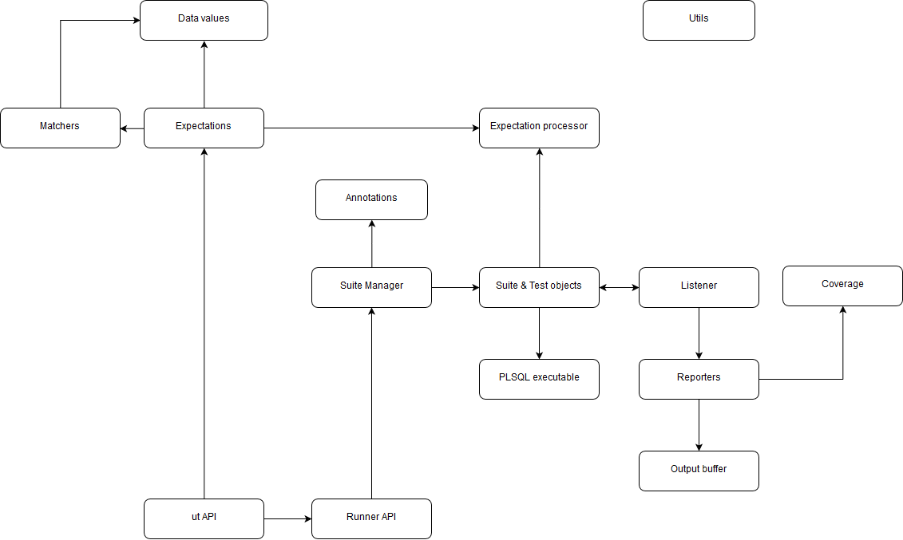

## How to contribute ##

The following are the guidelines everyone should use to contribute to utPLSQL.  
Changes are welcome from all members of the Community. 

## Getting Started ##

1. Create a [GitHub Account](https://github.com/join).
2. Fork the utPLSQL Repository and setup your local Repository.
     * Each of the steps below are detailed in the [how to Fork](https://help.github.com/articles/fork-a-repo) article!
     * Clone your Fork to your local machine.
     * Configure "upstream" remote to the [utPLSQL repository](https://github.com/utPLSQL/utPLSQL.git).
3. For each change you want to make:
     * Make sure your forked repository is up to date with upstream before you start coding. See [syncing your local repository](https://help.github.com/articles/syncing-a-fork) with upstream utPLSQL repository.
     * Create a new branch for your change. We use `feature/feature_name` or `bugfix/fixed_issue_name` to identify branch types.
     * Make your change in your new branch. 
     * Make sure your change is covered with unit tests.
     * **Verify code compiles and all existing and new unit tests pass.**
         * The quickest way to have a Pull Request not approved, is to submit code that does not compile or pass tests.
     * Commit change to your local repository.
     * Push change to your remote repository.
     * Submit a [Pull Request](https://help.github.com/articles/using-pull-requests) into develop branch.
     * Note: local and remote branches can be deleted after pull request has been merged.

## Coding Standards ##

* We use snake case for all identifiers in PLSQL code. This separates keywords in names with underscores.  `execute_test`
* All code is lower case.
* Prefixes:
	* Arguments to procedures and functions will start with `a_` an Example would be procedure `is_valid(a_owner_name varchar2)`
	* Object types and packages will start with `ut_`
	* Local variables `l_`
	* Global variables `g_`
	* Global Constants start with `gc_`
	* Types in packages, objects start with `t_`
	* Nested Tables start with `tt_`
* varchar2 lengths are set in characters not bytes 


## Configuring local environment ##

Your local environment can be of any flavor (Unix/Linux/Windows/Mac). 
At minimum you need to have Oracle database 11.2 XE accessible for the project and SYS account access to install and develop utPLSQL.

We use four different database accounts (users) for development process.
* `ut3_latest_release` - holds latest released version of utPLSQL. This schema holds the testing framework used for self-testing of utPLSQL development.
* `ut3` - holds latest (current) development version of utPLSQL. This is the schema you will be working on.
* `ut3_tester` - holds unit test packages for development of utPLSQL.
* `ut3$user#` - used for testing accessibility to schema names with special characters.


### To get started with development, follow the below steps.

_If you're using Windows, run the shell scripts using `GIT bash` - Windows-based bash command line._

**Clone your fork of utPLSQL git repository** 
```bash
# clone your fork of utPLSQL
git clone https://github.com/your account/utPLSQL.git utPLSQL

cd utPLSQL

# add main project repo as upstream
git remote add upstream https://github.com/utPLSQL/utPLSQL.git

# fetch all remote repositories
git fetch --all
```

**Prepare environment script**

Copy the environment variables template `development/template.env.sh` to `development/env.sh` 
```bash
cp development/template.env.sh development/env.sh
chmod u+w development/env.sh
```

You might have to adjust the following lines in `development/env.sh`:
```bash
export SQLCLI=sql # For sqlcl client
#export SQLCLI=sqlplus # For sqlplus client
export CONNECTION_STR=127.0.0.1:1521/xe # Adjust the connect string
export ORACLE_PWD=oracle # Adjust your local SYS password
```

**Download utPLSQL release sources and utplsq-cli**

_The below script is fetching latest release version from utPLSQL repository. Latest release version is used for self-testing._
```bash
development/refresh_sources.sh
```

**Setup local database for utPLSQL development**
```bash
development/install.sh
```

That's it! You now have the following:
- sources from `develop` branch of your fork of utPLSQL repository in `utPLSQL/ut3_latest_release` directory
- sources from `master` branch of utPLSQL/utPLSQL repository in `utPLSQL/ut3_latest_release` directory
- binaries of `utplsql-cli` in `utPLSQL/utPLSQL-cli` directory
- database users created
- utPLSQL develop version deployed to `ut3` schema
- utPLSQL released version deployed to `ut3_latest_release`

At any time, if you need to refresh your database, the below scripts might be helpful. 

### Cleanup of utPLSQL installation in local database
```bash
development/cleanup.sh
```

### Reinstalling utPLSQL development in `ut3` schema
```bash
development/refresh_ut3.sh
```

Whenever a new version of utPLSQL or a new version of utPLSQL-cli is available, use `development/refresh_sources.sh` to refresh files in your local project folders.  

## Modules ##

Below diagram gives a high-level overview of utPLSQL v3 modules and their dependencies.
Dependencies to `ut_util` are not shown as most of modules are depending on it.




## Build Environment ##

We are using private docker images to test utPLSQL for our Travis CI builds. The following versions of Oracle Database are being used.

* 11g XE R2
* 12c SE R1
* 12c SE R2

These images are based on the slimmed versions [official dockerfiles released by Oracle](https://github.com/utPLSQL/docker-scripts), but due to licensing restrictions, we can't make the images public.
You can build your own and use it locally, or push to a private docker repository.

The build steps are simple if you already have some experience using Docker. You can find detailed information about how to build your own image with a running database in: [example of creating an image with pre-built DB](https://github.com/oracle/docker-images/blob/master/OracleDatabase/samples/prebuiltdb/README.md)

> You can find more info about the official Oracle images on the [Oracle Database on Docker](https://github.com/oracle/docker-images/tree/master/OracleDatabase) GitHub page.

> If you are new to Docker, you can start by reading the [Getting Started With Docker](https://docs.docker.com/engine/getstarted/) docs.

### Docker Build Notes ###

* You need to comment out the VOLUME line. This step is required, because volumes are not saved when using `docker commit` command.
* When the build process is complete, you will run the container to install the database. Once everything is set up and you see the message "DATABASE IS READY!", you may change the password and stop the running container. After the container is stopped, you can safely commit the container.
* You can use the --squash experimental docker tag to reduce the image size. Example:
```
docker build --force-rm --no-cache --squash -t oracle/db-prebuilt .
```

Travis will use your Docker Hub credentials to pull the private images, and the following secure environment variables must be defined.

Variable | Description
---------|------------
**DOCKER_USER**<br />**DOCKER_PASSWORD** | _Your Docker Hub website credentials. They will be used to pull the private database images._

### SQLCL ###

Our build configuration uses SQLCL to run the scripts, and you need to configure a few additional secure environment variables. After the first build, the downloaded file will be cached.

Variable | Description
---------|------------
**ORACLE_OTN_USER<br />ORACLE_OTN_PASSWORD** | _Your Oracle website credentials. They will be used to download SQLCL._


## New to GIT ##

If you are new to GIT here are some links to help you with understanding how it works.    

- [GIT Documentation](http://git-scm.com/doc)
- [Atlassian Git Tutorial](https://www.atlassian.com/git/tutorial/git-basics)
- [What are other resources for learning Git and GitHub](https://help.github.com/articles/what-are-other-good-resources-for-learning-git-and-github) 
