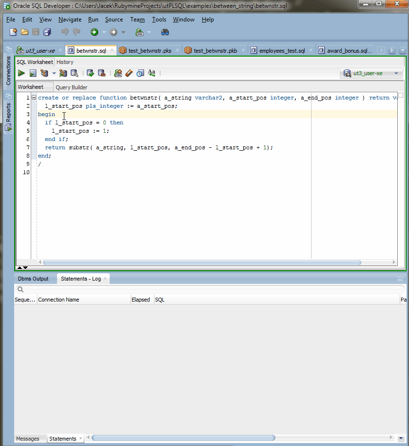

# Introduction to utPLSQL

utPLSQL is a Unit Testing framework for Oracle PL/SQL.
The framework follows industry standards and best patterns of modern Unit Testing frameworks like [JUnit](http://junit.org/junit4/) and [RSpec](http://rspec.info/)

  - User Guide
       - [Installation](userguide/install.md)
       - [Getting Started](userguide/getting-started.md)
       - [Annotations](userguide/annotations.md)
       - [Expectations](userguide/expectations.md)
       - [Running unit tests](userguide/running-unit-tests.md)
       - [Using the ut_run script](userguide/ut_run-script.md)
       - [Testing best pracitces](userguide/best-practices.md)
       - [Upgrade utPLSQL](userguide/upgrade.md)
  - Reporting
       - [Using reporters](userguide/reporters.md)
       - [Reporting errors](userguide/exception-reporting.md)
       - [Code coverage](userguide/coverage.md)
  - About
       - [Project Details](about/project-details.md)
       - [License](about/license.md)
       - [Support](about/support.md)
       - [Authors](about/authors.md)
       - [Contributing](about/CONTRIBUTING.md)

# Three steps
With just three simple steps you can define and run your unit tests for PLSQL code.
 
1. Install the utPLSQL framework 
2. Create Unit Tests to for the code
3. Run the tests

Here is how you can simply create tested code, unit tests and execute the tests using SQL Developer

Check out the sections on [annotations](userguide/annotations.md) and [expectations](userguide/expectations.md) to see how to define your tests.  

# Command line 
The `ut_run.sql` script is a powerful thing - it can provide output from the tests on the fly.
You can also use it to have coloured output from the test, and if you try to test code that was dropper, all of unit tests related to that code will fail.

Look into [ut_run.sql script options](userguide/ut_run-script.md) to see more.

# Coverage
If you want to have code coverage gathered on your code , it's best to use `ut_run.sql` to execute your tests with multiple reporters and have both test execution report as well as coverage report saved to a file.
Check out the [coverage documentation](userguide/coverage.md) for options of coverage reporting

    

