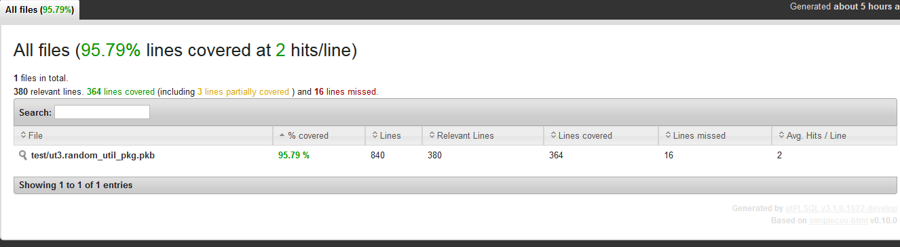
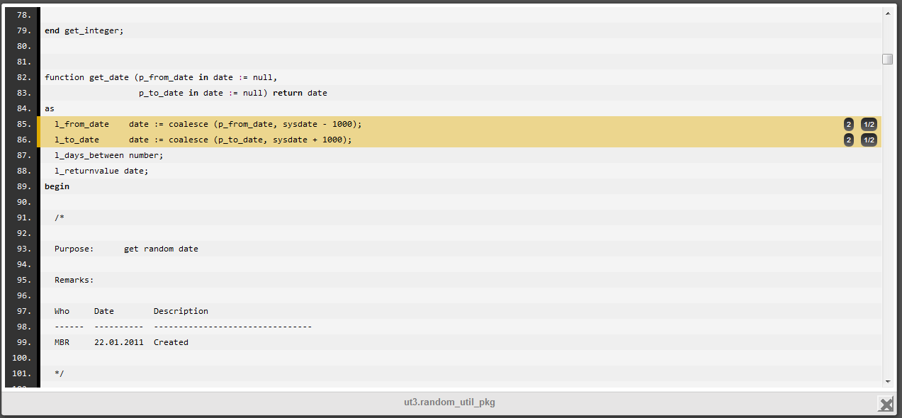
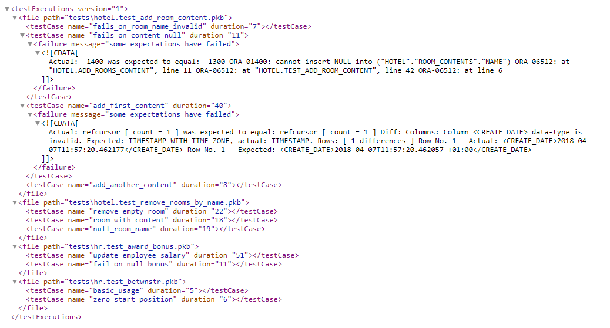

# Coverage
utPLSQL comes with a built-in coverage reporting engine. The code coverage reporting uses DBMS_PROFILER package provided with Oracle database.
Code coverage is gathered for the following source types:
* package bodies
* type bodies
* triggers
* procedures
* functions

**Note**

> The package and type specifications are excluded from code coverage analysis. This limitation is introduced to avoid false-negatives. Typically package specifications contain no executable code. The only exception is initialization of global constants and variables in package specification. Since most package specifications are not executable at all, there is no information available on the number of lines covered and those would be reported as 0% covered, which is not desirable.

To obtain information about code coverage for unit tests, run utPLSQL with one of built-in code coverage reporters.
The following code coverage reporters are supplied with utPLSQL:
* `ut_coverage_html_reporter` - generates a HTML coverage report providing summary and detailed information on code coverage. The HTML reporter is based on the open-source [simplecov-html](https://github.com/colszowka/simplecov-html) reporter for Ruby. It includes source code of the code that was covered (if possible)  
* `ut_coveralls_reporter` - generates a [Coveralls compatible JSON](https://coveralls.zendesk.com/hc/en-us/articles/201774865-API-Introduction) coverage report providing detailed information on code coverage with line numbers. This coverage report is designed to be consumed by cloud services like [Coveralls](https://coveralls.io)
* `ut_coverage_sonar_reporter`  - generates a [Sonar Compatible XML](https://docs.sonarqube.org/display/SONAR/Generic+Test+Data) coverage report providing detailed information on code coverage with line numbers. This coverage report is designed to be consumed by services like [SonarQube/SonarCloud](https://about.sonarcloud.io/)
* `ut_coverage_cobertura_reporter`  - generates a basic Cobertura coverage (http://cobertura.sourceforge.net/xml/coverage-04.dtd) report providing detailed information on code coverage with line numbers. This coverage report is designed to be consumed by services like TFS and Jenkins. Check this link for an example of XML generated by Java: https://raw.githubusercontent.com/jenkinsci/cobertura-plugin/master/src/test/resources/hudson/plugins/cobertura/coverage-with-data.xml

## Security model
utPLSQL code coverage uses DBMS_PROFILER to gather information about the execution of code under test and therefore follows the [DBMS_PROFILER's Security Model](https://docs.oracle.com/database/121/ARPLS/d_profil.htm#ARPLS67465).
In order to be able to gather coverage information, the user executing unit tests needs to be either:
* The owner of the code that is being tested
* Have the following privileges to be able to gather coverage on code owned by other users:
    * `create any procedure` system privilege
    * `execute` privilege on the code that is being tested (not only the unit tests) or `execute any procedure` system privilege

If you have `execute` privilege on the code that is being tested, but do not have `create any procedure` system privilege, then the code that is being tested will be reported as not covered (coverage = 0%).
If you have `execute` privilege only on the unit tests, but do not have `execute` privilege on the code that is being tested, the code will not be reported by coverage - as if it did not exist in the database.
If the code that is being tested is complied as NATIVE, the code coverage will not be reported as well.

## Running unit tests with coverage
Using the code coverage functionality is as easy as using any other [reporter](reporters.md) for the utPLSQL test-run. You just run your tests from your preferred SQL tool and save the reporter results to a file.
All you need to do is pass the constructor of the reporter to the `ut.run` procedure call.

Example:
```sql
begin
  ut.run(ut_coverage_html_reporter());
end;
/
```
The above command executes all unit tests in the **current schema**, gathers information about code coverage and outputs the HTML report as text into DBMS_OUTPUT.
The `ut_coverage_html_reporter` will produce an interactive HTML report. You can see a sample of code coverage for the utPLSQL project [here](https://utplsql.github.io/utPLSQL-coverage-html/)

The report provides summary information with a list of source code that should be covered.


The report allow you to navigate to each source file and inspect line by line coverage.


#### Oracle 12.2 extended coverage with profiler and block coverage
Using data collected from profiler and block coverage running parallel we are able to enrich information about coverage.
For every line recorded by the profiler if we have a partially covered same line in block coverage we will display that information
presenting line as partially covered, displaying number of block and how many blocks have been covered in that line.The feature will be automatically enabled in the Oracle database version 12.2 and higher, for older versions current profiler will be used.

utPLSQL installation automatically creates tables needed by `dbms_plsql_code_coverage` on databases in versions above 12c Release 1.
Due to security model of `dbms_plsql_code_coverage` package, utPLSQL grants access to those tables and creates synonyms for those tables.
The access and synonyms will be public when using the headless installation. This approach avoids complexity of forcing every user of utPLSQL framework to create tables on their own.    

Sample output:





### Coverage reporting options

There are two distinct ways to gather code coverage:
- Coverage on database schema(s)
- Coverage on project files

Those two options are mutually exclusive and cannot be mixed.
By default, when using one of coverage reporters, coverage is gathered on schema(s).

The parameters used to execute tests determine if utPLSQL will be using one approach or the other.

The database schema(s) containing the tests that were executed during the run will be reported on by coverage reporter.

**Note**

> Regardless of the options provided, all unit test packages are excluded from the coverage report. Coverage reports provide information only about the **tested** code.

The default behavior of coverage reporting can be altered using invocation parameters.

### Schema based Coverage

To gather coverage for all objects in the **current schema** execute tests with coverage report as argument.
This is the default reporting option and therefore additional coverage options don't need to be provided. 

```sql
exec ut.run(ut_coverage_html_reporter());
```

**Note**

> When no filters are used, the size of the coverage report will depend two factors:
> - the type of report (does the report include source code or not)
> - the amount of source code in the database schema
>
>Keep in mind that for schemas containing a lot of code, it can take quite some time to produce the coverage report.

#### Setting coverage schema(s)

By default, coverage is gathered on the schema(s) derived from suite paths provided to execute tests.
This is a valid approach as long as your test packages and tested code share the same schema.

So when you run:
```sql
exec ut.run(ut_varchar2_list('user_1','user_2'), ut_coverage_html_reporter());
```
Coverage will be gathered on both `user_1` and `user_2` objects.

If your tests live in a different schema from the tested code you may override the default behavior by providing an explicit list of coverage schema names.

In the example below, coverage will still be gathered for `user_1` and `user_2` objects, even thought we run the tests located in schema `unit_test_schema`

```sql
exec ut.run('unit_test_schema', ut_coverage_html_reporter(), a_coverage_schemes => ut_varchar2_list('user_1','user_2') );
```

#### Filtering objects in coverage reports

There are two options that can be used to narrow down the scope of coverage report:
- `a_include_objects` - list of `[object_owner.].object_name` to be included in the coverage report
- `a_exclude_objects` - list of `[object_owner.].object_name` to be excluded from the coverage report

You may specify both _include_ and _exclude_ object lists to gain more control over what needs to be included / excluded from the coverage report.

The object owner is optional in the object list.
If you do not provide an object owner, the _include_/_exclude_ list will be considered for every schema used for coverage gathering (as described above).


Example: Limiting coverage by object name, for tested code located in the same schema as the unit tests.
```sql
exec ut.run(ut_varchar2_list('user_1','user_2'), ut_coverage_html_reporter(), a_include_objects=>ut_varchar2_list('award_bonus'));
```
Executes all tests in schemas: `user_1` and `user_2`. Coverage will only be reported on objects `user_1.award_bonus`, `user_2.award_bonus`


Example: Limiting coverage by object name, for tested code located in different schemas than the unit tests.
```sql
begin
  ut.run(
    'unit_test_schema', ut_coverage_html_reporter(),
     a_coverage_schemes => ut_varchar2_list('user_1','user_2'),
     a_include_objects => ut_varchar2_list('award_bonus', 'betwnstr')
  );
end;
```
Executes all tests in schema `unit_test_schema`. Coverage will only be reported on objects `user_1.award_bonus`, `user_2.award_bonus`, `user_1.betwnstr`, `user_2.betwnstr`.
Objects that do not exist in the database but were specified in `a_include_objects` will be ignored.

Example: Limiting coverage by object owner and name.
```sql
begin
  ut.run(
    'unit_test_schema', ut_coverage_html_reporter(),
     a_include_objects => ut_varchar2_list('user_1.award_bonus','user_2.betwnstr')
  );
end;
```
Executes all tests in schema `unit_test_schema`. Coverage will only be reported on objects `user_1.award_bonus`, `user_2.betwnstr`

The `a_exclude_objects` can be used in the same way as `a_include_objects`.

Example: Excluding objects from coverage report by providing a list of object owner/name to be excluded.
```sql
begin
  ut.run(
    'unit_test_schema.test_award_bonus', ut_coverage_html_reporter(), 
    a_exclude_objects => ut_varchar2_list('ut3_user.betwnstr')
  );
end;
```
Executes test `test_award_bonus` in schema `unit_test_schema`. Coverage will be reported on all objects in schema `ut3_user` except the `betwnstr` object.

**Note**
> Filtering using `a_include_objects` and `a_exclude_objects` is only applicable when gathering coverage for a schema. Those filters are not applied when reporting coverage on project files.

**Note**
> When running coverage on schema objects, all source code of package bodies, functions, procedures, type bodies and triggers that were not executed will be reported as having 0% code coverage and all source code lines will show as uncovered.
> This is different than the behavior when gathering coverage on project files.

### Project based Coverage

utPLSQL provides reporters that produce reports consumable by external tools like `Sonar`/`SonarCloud` & `Coveralls`.

Services like Sonar, Coveralls and others perform analysis based on source code in project files.
They are abstracted from database, schema names, packages, procedures and functions, and operate on a more generic concept of project source code.

To be able to effectively use reporters dedicated for those tools, utPLSQL provides functionality for mapping database object names to project files.

There are a few significant differences when running coverage on project files compared to running coverage on schema(s).
- Coverage is only reported on objects that were successfully mapped to project files.
- Project files (database objects) that were not executed at all are not reported as fully uncovered. It is up to the consumer (Sonar/Coveralls) to determine if project file should be considered as 0% coverage or just ignored.

In order to successfully use coverage on project files, those files must be mapped to database objects.

Though you can gather project based code coverage directly using `exec ut.run(...)`, it is highly recommended to use [utPLSQL-cli](https://github.com/utPLSQL/utPLSQL-cli) command line client.

The examples below are using utPLSQL-cli to execute tests and gather coverage information.

#### File mapping using default parameters

The example below illustrates a directory structure supported by the default parameters of utPLSQL.
The structure represents a multi-schema project with file names indicating object owner.
```
C:
  \my_project
    \sources
      \hotel.add_rooms_content.prc
      \hotel.remove_rooms_by_name.prc
      \hotel.rooms.tbl
      \hr.award_bonus.prc
      \hr.betwnstr.fnc
      \hr.employees_test.tbl
    \tests
      \hotel.test_add_room_content.pkb
      \hotel.test_add_room_content.pks
      \hotel.test_remove_rooms_by_name.pkb
      \hotel.test_remove_rooms_by_name.pks
      \hr.test_award_bonus.pkb
      \hr.test_award_bonus.pks
      \hr.test_betwnstr.pkb
      \hr.test_betwnstr.pks
``` 

By default, utPLSQL will convert file paths into database objects using the following regular expression `/(((\w|[$#])+)\.)?((\w|[$#])+)\.(\w{3})$`
- object owner (if it is present) is identified by the expression in the second set of  brackets
- object name is identified by the expression in the fourth set of brackets
- object type is identified by the expression in the sixth set of brackets


**Note**
> utPLSQL will replace any '\\' with '/' for the purpose of mapping files to objects. The paths shown in the results will remain (contain '\' where it was present).
> This is done to simplify the syntax of regular expressions. Regular expression will always use '/' as a directory separator on a file path regardless of whether you're on a Windows or Unix system.    

**Note**
> Below examples assume that you have downloaded latest version of [utPLSQL-cli](https://github.com/utPLSQL/utPLSQL-cli/releases) and extracted it into your projects root directory (my_project).
> The examples assume that you run the utPLSQL-cli from `my_project` directory.    

Windows:
```
utPLSQL-cli\bin\utplsql run test_runner/pass@db_host:db_port/db_service_name ^
 -p=hr,hotel ^
 -source_path=sources ^
 -test_path=tests ^
 -f=ut_coverage_html_reporter -o=coverage.html ^
 -f=ut_sonar_test_reporter    -o=test_results.xml
```

Bash:  
```bash
utPLSQL-cli/bin/utplsql run test_runner/pass@db_host:db_port/db_service_name \
 -p=hr,hotel \
 -source_path=sources \
 -test_path=tests \
 -f=ut_coverage_html_reporter -o=coverage.html \
 -f=ut_sonar_test_reporter    -o=test_results.xml
```

The above commands will:
- connect as user `test_runner`
- run all utPLSQL v3 tests for users `hr`, `hotel`
- map database code to project files in `sources` directory and save code coverage results into `coverage.html`
- map test packages to project files in `tests` directory and save test results into `test_results.xml` 

To better understand the default regular expression used, have a look [here](https://regex101.com/r/4qP6Aj/3).

Tested code is mapped to files in `coverage.html`


Unit test code is mapped to files in `test_results.xml`



#### Using custom regular expressions

If your project directory structure is different, you can use additional configuration parameters to tell utPLSQL how the project files are to be mapped into database objects.  

Example: Using custom regular expressions on a multi-schema project with separate directories for each object owner.
```
C:
  \my_project
    \sources
      \hotel
        \add_rooms_content.prc
        \remove_rooms_by_name.prc
        \rooms.tbl
      \hr
        \award_bonus.prc
        \betwnstr.fnc
        \employees_test.tbl
    \tests
      \hotel
        \test_add_room_content.pkb
        \test_add_room_content.pks
        \test_remove_rooms_by_name.pkb
        \test_remove_rooms_by_name.pks
      \hr
        \test_award_bonus.pkb
        \test_award_bonus.pks
        \test_betwnstr.pkb
        \test_betwnstr.pks
```

The command below will gather coverage and map files to database objects using custom regular expression.
Note that the owner/name/type subexpressions don't need to be explicitly specified if they are same as default values ( 2/3/4 ).
In the below example, they were specified explicitly only for `source_path`, `test_path` doesn't have subexpressions specified and so they are default (2/3/4).

Windows:
```
utPLSQL-cli\bin\utplsql run test_runner/pass@db_url ^
 -p=hr,hotel ^
 -source_path=sources ^
 -regex_expression="/((\w+)/)?(\w+)\.(\w{3})$" ^
 -owner_subexpression=2 ^
 -name_subexpression=3 ^
 -type_subexpression=4 ^
 -test_path=tests -regex_expression="/((\w+)/)?(\w+)\.(\w{3})$" ^
 -f=ut_coverage_html_reporter -o=coverage.html ^
 -f=ut_sonar_test_reporter -o=test_results.xml ^
```

Bash:
```bash
utPLSQL-cli/bin/utplsql run test_runner/pass@db_url \
 -source_path=sources \
 -regex_expression="/((\w+)/)?(\w+)\.(\w{3})$" \
 -owner_subexpression=2 \
 -name_subexpression=3 \
 -type_subexpression=4 \
 -test_path=tests -regex_expression="/((\w+)/)?(\w+)\.(\w{3})$" \
 -owner_subexpression=2 \
 -name_subexpression=3 \
 -type_subexpression=4 \
 -f=ut_coverage_html_reporter -o=coverage.html \
 -f=ut_sonar_test_reporter -o=test_results.xml
```  

You can specify different mapping rules for source files and for test files - see [utPLSQL-cli readme](https://github.com/utPLSQL/utPLSQL-cli) for details.

To better understand the regular expression used, have a look [here](https://regex101.com/r/0lk0rV/1/).
 
Tested code is mapped to files in `coverage.html`


Unit test code is mapped to files in `test_results.xml`


#### Explicitly specifying object owner

When dealing with projects that operate within a single schema the project structure probably doesn't indicate the owner.
In such scenarios, you can explicitly specify the object owner for both tests and source code.

Example: Single-schema project - no indication of object owner
```
C:
  \my_project
    \sources
      \betwnstr.fnc
    \tests
      \test_betwnstr.pkb
      \test_betwnstr.pks
```

The command below will gather coverage and map files to database objects.
For the database objects mapped to `souces` directory user `code_owner`  will be used.
For the database objects mapped to `tests`  directory user `tests_owner` will be used. 

Windows:
```
utPLSQL-cli\bin\utplsql run test_runner/pass@db_url ^
 -p=tests_owner ^
 -source_path=sources -owner=code_owner ^
 -test_path=tests     -owner=tests_owner ^
 -f=ut_coverage_html_reporter -o=coverage.html ^
 -f=ut_sonar_test_reporter    -o=test_results.xml
```

Bash:
```bash
utPLSQL-cli/bin/utplsql run test_runner/pass@db_url \
 -p=tests_owner \
 -source_path=sources -owner=code_owner \
 -test_path=tests     -owner=tests_owner \
 -f=ut_coverage_html_reporter -o=coverage.html \
 -f=ut_sonar_test_reporter    -o=test_results.xml
```

**Note**  
> When the project folder structure does not provide any information about source code owner and test owner, you can specify the owner for tests and owner for code explicitly.
> Such project configuration supports only single-owner for source code and single owner for tests.  

Tested code is mapped to files in `coverage.html`


Unit test code is mapped to files in `test_results.xml`


#### Custom mapping of object types

By default, when mapping project files to database objects, utPLSQL will identify the object type by file extension.

The table below represents the default mapping of file extensions to database object types.

| file extension | object type |
| -------------- | ----------- |
| tpb | type body |
| pkb | package body |
| bdy | package body |
| trg | trigger |
| fnc | function |
| prc | procedure |

If your project naming convention differs and your file extensions do not match the above, or you simply name all of your files with `.sql` suffix, you can still use utPLSQL, but you need to provide custom mapping for object types.


Example: Multi-schema project with separate directories for each object owner and object type
```
C:
  \my_project
    \sources
      \hotel
        \functions
        \packages
        \packages_bodies
        \procedures
          \add_rooms_content.sql
          \remove_rooms_by_name.sql
        \tables
          \rooms.sql
        \triggers
        \types
        \type_bodies
      \hr
        \functions
          \betwnstr.sql
        \packages
        \package_bodies
        \procedures
          \award_bonus.sql
        \tables
          \employees_test.sql
        \triggers
        \types
        \types_bodies
    \tests
      \hotel
        \packages
          \test_add_room_content.sql
          \test_remove_rooms_by_name.sql
        \packages_bodies
          \test_add_room_content.sql
          \test_remove_rooms_by_name.sql
      \hr
        \packages
          \test_award_bonus.sql
          \test_betwnstr.sql
        \packages_bodies
          \test_award_bonus.sql
          \test_betwnstr.sql
```


Windows:
```
utPLSQL-cli\bin\utplsql run test_runner/pass@db_url ^
 -p=hr,hotel ^
 -source_path=sources ^
 -regex_expression="/(\w+)/(\w+)/(\w+)\..{3}$" ^
 -type_mapping="packages_bodies=PACKAGE BODY/types_bodies=TYPE BODY/triggers=TRIGGER/procedures=PROCEDURE/functions=FUNCTION" ^
 -owner_subexpression=1 ^
 -name_subexpression=3 ^
 -type_subexpression=2 ^
 -test_path=tests -regex_expression="/(\w+)/(\w+)/(\w+)\..{3}$" ^
 -type_mapping="packages_bodies=PACKAGE BODY/types_bodies=TYPE BODY/triggers=TRIGGER/procedures=PROCEDURE/functions=FUNCTION" ^
 -owner_subexpression=1 ^
 -name_subexpression=3 ^
 -type_subexpression=2 ^
 -f=ut_coverage_html_reporter -o=coverage.html ^
 -f=ut_sonar_test_reporter -o=test_results.xml
```

Bash:
```bash
utPLSQL-cli/bin/utplsql run test_runner/pass@db_urll \
 -p=hr,hotel \
 -source_path=sources \
 -regex_expression="/(\w+)/(\w+)/(\w+)\..{3}$" \
 -type_mapping="packages_bodies=PACKAGE BODY/types_bodies=TYPE BODY/triggers=TRIGGER/procedures=PROCEDURE/functions=FUNCTION" \
 -owner_subexpression=1 \
 -name_subexpression=3 \
 -type_subexpression=2 \
 -test_path=tests -regex_expression="/(\w+)/(\w+)/(\w+)\..{3}$" \
 -type_mapping="body=PACKAGE BODY/type_body=TYPE BODY/trigger=TRIGGER" \
 -owner_subexpression=1 \
 -name_subexpression=3 \
 -type_subexpression=2 \
 -f=ut_coverage_html_reporter -o=coverage.html \
 -f=ut_sonar_test_reporter -o=test_results.xml
```

The parameter `type_mapping` accepts a list of a key-value pairs representing a mapping of regex subexpression to database object type.  

To better understand the regular expression used, have a look [here](https://regex101.com/r/Vd97v0/1).

Tested code is mapped to files in `coverage.html`


Unit test code is mapped to files in `test_results.xml`


#### Object-file mapping rules

In order to allow deterministic and accurate mapping of database source-code into project files, the project directory and file structure needs to meet certain criteria.  
- Source code is kept separate from test code (separate directories)
- Each database (source-code) object is stored in an individual file. Package/type specification is kept separate from its body.
- File name (file path) contains the name of database object
- Each file-path clearly identifies object type (by file extension)
- Each file contains representation of database object "as is". No extra commands (like `set echo off` `ALTER SESSION SET PLSQL_CCFLAGS = 'debug:TRUE';`) or blank lines are present before `CREATE TYPE`,`CREATE TYPE` etc.
- When project is spanning across multiple database schemes, each file-path clearly and uniformly identifies object owner


#### File mapping from SQL

The `ut.run` command provides interface to map project into database objects when executing tests.
While it is much easier to perform mapping directly from command line, it is possible to achieve similar functionality from any SQL client.
The main differences when using the `ut.run(...)` command, will be:
- you can only use single reporter and therefore will get only one report from test execution
- you need to provide fill list of project files rather than point to `sources` and `tests` directories

Example project directory structure. 
```
C:
  \my_project
    \sources
      \hotel
        \functions
        \packages
        \packages_bodies
        \procedures
          \add_rooms_content.sql
          \remove_rooms_by_name.sql
        \tables
          \rooms.sql
        \triggers
        \types
        \type_bodies
      \hr
        \functions
          \betwnstr.sql
        \packages
        \package_bodies
        \procedures
          \award_bonus.sql
        \tables
          \employees_test.sql
        \triggers
        \types
        \types_bodies
    \tests
      \hotel
        \packages
          \test_add_room_content.sql
          \test_remove_rooms_by_name.sql
        \packages_bodies
          \test_add_room_content.sql
          \test_remove_rooms_by_name.sql
      \hr
        \packages
          \test_award_bonus.sql
          \test_betwnstr.sql
        \packages_bodies
          \test_award_bonus.sql
          \test_betwnstr.sql
```

To execute all tests and map database source code into source file names you could use the following command in any SQL client:        

```sql
begin
  ut.run(
    ut_varchar2_list('hr','hotel'),
    ut_coverage_html_reporter(),
    a_source_file_mappings =>
      ut_file_mapper.build_file_mappings(
        a_file_paths  => ut_varchar2_list(
          'sources\hotel\procedures\add_rooms_content.sql',
          'sources\hotel\procedures\remove_rooms_by_name.sql',
          'sources\hotel\tables\rooms.sql',
          'sources\hr\functions\betwnstr.sql',
          'sources\hr\procedures\award_bonus.sql',
          'sources\hr\tables\employees_test.sql'
          ),
        a_regex_pattern => '/(\w+)/(\w+)/(\w+)\..{3}$',
        a_object_owner_subexpression => 1,
        a_object_name_subexpression => 3,
        a_object_type_subexpression => 2,
        a_file_to_object_type_mapping => ut_key_value_pairs(
          ut_key_value_pair('packages_bodies', 'PACKAGE BODY'),
          ut_key_value_pair('types_bodies', 'TYPE BODY'),
          ut_key_value_pair('triggers', 'TRIGGER'),
          ut_key_value_pair('procedures', 'PROCEDURE'),
          ut_key_value_pair('functions', 'FUNCTION')
        )
      )
  );
end;
```

To execute all tests and map database tests code into test file names you could use the following command in any SQL client:        
```sql
begin
  ut.run(
    ut_varchar2_list('hr','hotel'),
    ut_sonar_test_reporter(),
    a_test_file_mappings =>
      ut_file_mapper.build_file_mappings(
        a_file_paths  => ut_varchar2_list(
            'tests\hotel\packages\test_add_room_content.sql',
            'tests\hotel\packages\test_remove_rooms_by_name.sql',
            'tests\hotel\packages_bodies\test_add_room_content.sql',
            'tests\hotel\packages_bodies\test_remove_rooms_by_name.sql',
            'tests\hr\packages\test_award_bonus.sql',
            'tests\hr\packages\test_betwnstr.sql',
            'tests\hr\packages_bodies\test_award_bonus.sql',
            'tests\hr\packages_bodies\test_betwnstr.sql'
          ),
        a_regex_pattern => '/(\w+)/(\w+)/(\w+)\..{3}$',
        a_object_owner_subexpression => 1,
        a_object_name_subexpression => 3,
        a_object_type_subexpression => 2,
        a_file_to_object_type_mapping => ut_key_value_pairs(
          ut_key_value_pair('packages_bodies', 'PACKAGE BODY'),
          ut_key_value_pair('types_bodies', 'TYPE BODY'),
          ut_key_value_pair('triggers', 'TRIGGER'),
          ut_key_value_pair('procedures', 'PROCEDURE'),
          ut_key_value_pair('functions', 'FUNCTION')
        )
      )
  );
end;
```

## Reporting coverage outside of utPLSQL

utPSLQL allows fo standalone reporting code coverage across multiple database sessions. This functionality enables coverage reporting for external testing tools.

Following API calls enable the  standalone coverage reporting.

- `ut_runner.coverage_start( coverage_run_id );` - initiates code coverage within a session    
- `ut_runner.coverage_stop();` - stops gathering of code coverage within a session
- `.get_report( ... )` - coverage reporters function producing coverage report as pipelined data-set (to be used in SQL query) 
- `.get_report_cursor( ... )` - coverage reporters function producing coverage report as ref-cursor 

Example:
```sql
--SESSION 1
-- gather coverage on code using specific coverage_run_id value
declare
  l_coverage_run_id raw(32);
begin
  l_coverage_run_id := 'A6AA5B7361251CE6E053020011ACA055';
--  l_coverage_run_id := sys_guid;
  ut_runner.coverage_start(l_coverage_run_id);
  
  --The code to gather coverage on goes here   

  ut_runner.coverage_stop();
end;
/
```

```sql
--SESSION 2
-- alternative approach
-- gather coverage on code using specific coverage_run_id value
exec ut_runner.coverage_start('A6AA5B7361251CE6E053020011ACA055');  

--The code to gather coverage on goes here   

exec ut_runner.coverage_stop();
```


```sql
--SESSION 1 or SESSION2 2 or SESSION 3 
-- run after calls in SESSION 1 & 2 are finshed
-- retrieve coverage report in HTML format coverage_run_id value
select *
  from table(
    ut_coverage_html_reporter().get_report(
      a_coverage_options => ut_coverage_options(
        coverage_run_id => 'A6AA5B7361251CE6E053020011ACA055'
      )
    )
  ); 
```  

```sql
--SESSION 1 or SESSION2 2 or SESSION 3 
-- run after calls in SESSION 1 & 2 are finshed
declare
  l_results_cursor sys_refcursor;
begin
  l_results_cursor :=  ut_coverage_html_reporter().get_report_cursor(
      a_coverage_options => ut_coverage_options(
        coverage_run_id => 'A6AA5B7361251CE6E053020011ACA055'
      )
    );
  --fetch and process the cursor results
  close l_results_cursor;
end;
/
```  

Specification of parameters for `get_report` and `get_report_cursor`
```sql
function get_report(
   a_coverage_options ut_coverage_options,
   a_client_character_set varchar2 := null 
) return ut_varchar2_rows pipelined
```
 
```sql
function get_report_cursor(
   a_coverage_options ut_coverage_options,
   a_client_character_set varchar2 := null 
) return sys_refcursor
```
```sql
ut_coverage_options(
  coverage_run_id          raw,
  schema_names             ut_varchar2_rows := null,
  exclude_objects          ut_varchar2_rows := null,
  include_objects          ut_varchar2_rows := null,
  file_mappings            ut_file_mappings := null
);
```

The `a_client_character_set` is used to provide character set to the report. Coverage reports in XML and HTML format include this information to assure that HMTL/XML encoding tag is aligned with encoding of the report produced.
Use this parameter to provide encoding of your client application.   

The `a_coverage_options` parameter is used to control the scope and formatting of data returned by report.

`ut_coverage_options` object accepts the following arguments

- `coverage_run_id` - identifier of coverage run to generate report for - data-type `RAW(32)` 
- `schema_names` - optional - list of schema names to include in coverage report - data-type `UT_VARCHAR2_ROWS` 
- `exclude_objects` - optional - list of object names to exclude from report - data-type `UT_VARCHAR2_ROWS`   
- `include_objects` - optional - list of object names to gather coverage on - data-type `UT_VARCHAR2_ROWS`
- `file_mappings` - optional - list of schema names to gather coverage on - data-type `UT_FILE_MAPPINGS`

`coverage_run_id` parameter identifies a common coverage run. The valid value type for that parameter is RAW(32).
It is recommended to use `sys_guid()` to generate a common, unique identifier for a specific coverage run.
If the identifier is not unique, previous runs of coverage that used the same `coverage_run_id` will be aggregated to the resulting coverage report.    

For details on the meaning of `schema_names`, `exclude_objects`, `include_objects`, `file_mappings` see sections above.
Note that data-types of include/exclude/schema lists are different when calling `ut.run` vs. calling `get_report/get_report_cursor`.    
   
