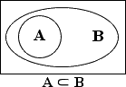
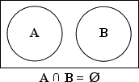

# Expectation concepts 
Validation of the code under test (the tested logic of procedure/function etc.) is performed by comparing the actual data against the expected data.

utPLSQL uses expectations and matchers to perform the check on the data.

Example of an expectation
```sql
begin
  ut.expect( 'the tested value' ).to_equal('the expected value');
end;
/
```

Returns following output via DBMS_OUTPUT:
```
FAILURE
  Actual: 'the tested value' (varchar2) was expected to equal: 'the expected value' (varchar2)
  at "anonymous block", line 2
```

Expectation is a combination of:
- the expected value
- optional custom message for the expectation 
- the matcher used to perform comparison
- them matcher parameters (actual value), depending on the matcher type
  

Matcher defines the comparison operation to be performed on expected (and actual) value.
Pseudo-code:
```sql
  ut.expect( a_actual {data-type} [, a_message {varchar2}] ).to_( {matcher} );
  ut.expect( a_actual {data-type} [, a_message {varchar2}] ).not_to( {matcher} );
```

Expectations provide two variants of syntax that you can use. Both variants are functionally-equal but give different usage flexibility.  

Syntax where matcher is passed as parameter to the expectation:
```sql
  ut.expect( a_actual ).to_( {matcher} );
  ut.expect( a_actual ).not_to( {matcher} );
  -- example
  ut.expect( 1 ).to_( be_null() );
```

Shortcut syntax, where matcher is directly part of expectation:
```sql
  ut.expect( a_actual ).to_{matcher};
  ut.expect( a_actual ).not_to_{matcher};
  
  --example
  ut.expect( 1 ).to_( be_null() );
```

When using shortcut syntax you don't need to surround matcher with brackets. Shortcut syntax is provided for convenience.

If you would like to perform more dynamic checks in your code, you could pass the matcher into a procedure like in the below example:
```sql
declare
  procedure do_check( p_actual varchar2, p_matcher ut_matcher ) is 
  begin
    ut.expect(p_actual).to_( p_matcher );
  end;
begin
  do_check( 'a', equal('b') );
  do_check( 'Alibaba', match('ali','i') );
end;
/
```

Returns following output via DBMS_OUTPUT:
```
FAILURE
  Actual: 'a' (varchar2) was expected to equal: 'b' (varchar2)
  at "anonymous block", line 4
  at "anonymous block", line 7
SUCCESS
  Actual: 'Alibaba' (varchar2) was expected to match: 'ali' , modifiers 'i'
```

**Note:**
> The examples in the document will be only using shortcut syntax, to keep the document brief.  

# Using expectations
There are two ways to use expectations:
- by invoking utPLSQL framework to execute suite(s) of utPLSQL tests  
- without invoking the utPLSQL framework - running expectations standalone

## Running expectations within utPLSQL framework
When expectations are ran a part of test suite, the framework tracks:
- status of each expectation 
- outcomes (messages) produced by each expectation
- call stack to each expectation

In this case:
- expectation results of are not sent directly to `dbms_output`
- utPLSQL Reporters used when running suite decide on how the expectation results are formatted and displayed    

Example of test suite with an expectation:
```sql
create or replace package test_divide as 
  --%suite(Divide two numbers)

  --%test(Returns result when divisor is not zero)
  procedure divide_6_by_2;
  
  --%test(Throws exception when divisor is zero)
  --%throws(zero_divide)
  procedure divide_by_0_throws;
end;
/

create or replace package body test_divide as 
  procedure divide_6_by_2 is
  begin
    ut.expect(6/2).to_equal(3);
  end;
    
  procedure divide_by_0_throws is
  begin
    ut.expect(6/0).to_be_not_null();
  end;
end;
/

exec ut.run('test_divide');

drop package test_divide;
```

Produces following outputs:
```
Package TEST_DIVIDE compiled


Package Body TEST_DIVIDE compiled

Divide two numbers
  Returns result when divisor is not zero [.003 sec]
  Throws exception when divisor is zero [.003 sec]
 
Finished in .009774 seconds
2 tests, 0 failed, 0 errored, 0 disabled, 0 warning(s)
 


PL/SQL procedure successfully completed.


Package TEST_DIVIDE dropped.
```

Please read about different options for [running test suites](running-unit-tests.md).
 
## Running expectations outside utPLSQL framework
When expectations are invoked outside of utPLSQL framework the outputs from expectations are redirected straight to `dbms_output`.

**Note:**
> The output from expectation contains call stack trace only when expectation fails.                                       
> Source code of the line which called the expectation is only reported when the line is part of in-database code (package) and the user calling expectation has privileges to see that source code.

**Important**
> Please do not use expectations as part of your production code. They are not designed to be used as part ot your code. Expectations are meant to be used only as part of your day-to-day testing activities.

**Note:**
> The examples in the document will be only using standalone expectations, to keep the document brief.  

# Matchers
utPLSQL provides the following matchers to perform checks on the expected and actual values.  

- `be_between( a_upper_bound {data-type}, a_lower_bound {data-type} )`
- `be_empty()`
- `be_false()`
- `be_greater_than( a_expected {data-type} )`
- `be_greater_or_equal( a_expected {data-type} )`
- `be_less_or_equal( a_expected {data-type} )`
- `be_less_than( a_expected {data-type} )`
- `be_like( a_mask {varchar2} [, a_escape_char {varchar2}] )`
- `be_not_null()`
- `be_null()`
- `be_true()`
- `equal( a_expected {data-type} [, a_nulls_are_equal {boolean}] )`
- `contain( a_expected {data-type})`
- `have_count( a_expected {integer} )`
- `match( a_patter {varchar2} [, a_modifiers {varchar2}] )`

## Providing a custom message
You can provide a custom failure message as second argument for the expectation by passing message as the second parameter to the expectation.
`ut.expect( a_actual {data-type}, a_message {varchar2} ).to_{matcher}`

Example:
````sql
exec  ut.expect( 'supercat', 'checked superhero-animal was not a dog' ).to_equal('superdog');
````

Returns following output via DBMS_OUTPUT:
```
FAILURE
  "checked superhero-animal was not a dog"
  Actual: 'supercat' (varchar2) was expected to equal: 'superdog' (varchar2)
  at "anonymous block", line 1
```
If the message is provided, it is being added to the normal failure message returned by the matcher.
This is mostly useful when your expectations accept dynamic content, as you can provide additional context to make failing test results more readable.

In most cases, there is no need to provide custom message to expectation. This is because utPLSQL identifies:
- The test used to execute the expectation
- The line number where the expectation is placed in your test code
- The line text of the expectation

Custom message is useful, if your expectation is placed in a shared procedure to perform a check and your test is using the procedure multiple times.

Example:
```sql
create or replace package shared_expectation_test is
  --%suite
  
  --%test
  procedure the_test;
end;
/
create or replace package body shared_expectation_test is
  procedure table_is_empty(p_table_name varchar2) is
    l_count integer;
  begin
    execute immediate 'select count(*) from '||p_table_name into l_count;
    ut.expect( l_count, 'Checking table '||p_table_name ).to_equal(0);
  end;
  
  procedure the_test is
  begin
    table_is_empty('ALL_USERS');
    table_is_empty('ALL_TABLES');
  end;
end;
/

exec ut.run('shared_expectation_test');
```  

Returns following output via DBMS_OUTPUT:
```
shared_expectation_test
  the_test [.064 sec] (FAILED - 1)
 
Failures:
 
  1) the_test
      "Checking table ALL_USERS"
      Actual: 28 (number) was expected to equal: 0 (number)
      at "UT3$USER#.SHARED_EXPECTATION_TEST.TABLE_IS_EMPTY", line 6 ut.expect( l_count, 'Checking table '||p_table_name ).to_equal(0);
      at "UT3$USER#.SHARED_EXPECTATION_TEST.THE_TEST", line 11
       
      "Checking table ALL_TABLES"
      Actual: 55 (number) was expected to equal: 0 (number)
      at "UT3$USER#.SHARED_EXPECTATION_TEST.TABLE_IS_EMPTY", line 6 ut.expect( l_count, 'Checking table '||p_table_name ).to_equal(0);
      at "UT3$USER#.SHARED_EXPECTATION_TEST.THE_TEST", line 12
       
Finished in .066344 seconds
1 tests, 1 failed, 0 errored, 0 disabled, 0 warning(s)
```  

In the tests results window you can see the list of failed expectations for a test as well as:
- the additional message for expectation
- the reason why the expectation failed
- the line number of the expectation
- the line text of the expectations
- the call stack for the expectation (in the example it's the lines that called the procedure `table_is_empty`)

## Negating a matcher

Expectations provide a very convenient way to perform a check on a negated matcher.

Syntax to check for matcher evaluating to true:
```sql
begin 
  ut.expect( a_actual {data-type} ).to_{matcher};
  ut.expect( a_actual {data-type} ).to_( {matcher} );
end;
```

Syntax to check for matcher evaluating to false:
```sql
begin
  ut.expect( a_actual {data-type} ).not_to_{matcher};
  ut.expect( a_actual {data-type} ).not_to( {matcher} );
end;
```

If a matcher evaluated to NULL, then both `to_` and `not_to` will cause the expectation to report failure.

Example:
```sql
declare
  l_actual boolean;
begin
  ut.expect( l_actual ).to_be_true();
  ut.expect( l_actual ).not_to_be_true();
end;
/
```

Returns following output via DBMS_OUTPUT:
```
FAILURE
  Actual: NULL (boolean) was expected to be true
  at "anonymous block", line 4
FAILURE
  Actual: NULL (boolean) was expected not to be true
  at "anonymous block", line 5
```
Since NULL is neither *true* nor *false*, both expectations will report failure.

# Supported data types

The matrix below illustrates the data types supported by different matchers.

|         Matcher         | blob | boolean | clob | date | number | timestamp | timestamp<br>with<br>timezone | timestamp<br>with<br>local<br>timezone | varchar2 | interval<br>year<br>to<br>month | interval<br>day<br>to<br>second | cursor | nested<br>table<br>/ varray | object | json |
| :---------------------: | :--: | :-----: | :--: | :--: | :----: | :-------: | :---------------------------: | :------------------------------------: | :------: | :-----------------------------: | :-----------------------------: | :----: | :-------------------------: | :----: | :--: |
|     **be_not_null**     |  X   |    X    |  X   |  X   |   X    |     X     |               X               |                   X                    |    X     |                X                |                X                |   X    |              X              |   X    |  X   |
|       **be_null**       |  X   |    X    |  X   |  X   |   X    |     X     |               X               |                   X                    |    X     |                X                |                X                |   X    |              X              |   X    |  X   |
|      **be_false**       |      |    X    |      |      |        |           |                               |                                        |          |                                 |                                 |        |                             |        |      |
|       **be_true**       |      |    X    |      |      |        |           |                               |                                        |          |                                 |                                 |        |                             |        |      |
|   **be_greater_than**   |      |         |      |  X   |   X    |     X     |               X               |                   X                    |          |                X                |                X                |        |                             |        |      |
| **be_greater_or_equal** |      |         |      |  X   |   X    |     X     |               X               |                   X                    |          |                X                |                X                |        |                             |        |      |
|  **be_less_or_equal**   |      |         |      |  X   |   X    |     X     |               X               |                   X                    |          |                X                |                X                |        |                             |        |      |
|    **be_less_than**     |      |         |      |  X   |   X    |     X     |               X               |                   X                    |          |                X                |                X                |        |                             |        |      |
|     **be_between**      |      |         |      |  X   |   X    |     X     |               X               |                   X                    |    X     |                X                |                X                |        |                             |        |      |
|        **equal**        |  X   |    X    |  X   |  X   |   X    |     X     |               X               |                   X                    |    X     |                X                |                X                |   X    |              X              |   X    |  X   |
|       **contain**       |      |         |      |      |        |           |                               |                                        |          |                                 |                                 |   X    |              X              |   X    |      |
|        **match**        |      |         |  X   |      |        |           |                               |                                        |    X     |                                 |                                 |        |                             |        |      |
|       **be_like**       |      |         |  X   |      |        |           |                               |                                        |    X     |                                 |                                 |        |                             |        |      |
|      **be_empty**       |  X   |         |  X   |      |        |           |                               |                                        |          |                                 |                                 |   X    |              X              |        |  X   |
|     **have_count**      |      |         |      |      |        |           |                               |                                        |          |                                 |                                 |   X    |              X              |        |  X   |


# Expecting exceptions

Testing is not limited to checking for happy-path scenarios. When writing tests, you often want to validate that in specific scenarios, an exception is thrown.

Use the `--%throws` annotation, to test for expected exceptions. 

Example:
```sql
create or replace function divide(x varchar2, y varchar2) return number is
begin
  return x/y;
end;
/

create or replace package test_divide as
  --%suite(Divide function)

  --%test(Throws divisor equal)
  --%throws(-01476)
  procedure raises_divisor_exception;
end;  
/

create or replace package body test_divide is

  procedure raises_divisor_exception is
    x integer;
  begin
    x := divide(6,0);
  end;

end;
/

exec ut.run('test_divide');
```

Returns following output via DBMS_OUTPUT:
```
Divide function
  Throws divisor equal [.007 sec]
 
Finished in .009229 seconds
1 tests, 0 failed, 0 errored, 0 disabled, 0 warning(s)
```

For more details see documentation of the [`--%throws` annotation.](annotations.md#throws-annotation)  


# Matchers 

You can choose different matchers to validate the your PL/SQL code is working as expected.


## be_between
Validates that the actual value is between the lower and upper bound.

Example:
```sql
declare
  l_timestamp     timestamp := current_timestamp;
  l_timestamp_tz  timestamp with time zone := systimestamp;
  l_timestamp_ltz timestamp with local time zone := systimestamp;
  l_interval_ds   interval day to second := interval '1' second;
  l_interval_ym   interval year to month := interval '1' year;
begin
  ut.expect( 3 ).to_be_between( 1, 3 );
  ut.expect( 5 ).to_( be_between( 1, 3 ) );
  ut.expect( 3 ).not_to_be_between( 1, 3 );
  ut.expect( 5 ).not_to( be_between( 1, 3 ) );  
  ut.expect( sysdate ).to_be_between( sysdate, sysdate + 1 );
  ut.expect( l_timestamp ).to_be_between( l_timestamp,  l_timestamp );
  ut.expect( systimestamp ).to_be_between( l_timestamp_tz, systimestamp );
  ut.expect( systimestamp ).to_be_between( l_timestamp_ltz, l_timestamp_ltz );
  ut.expect( l_interval_ds ).to_be_between( interval '0.1' second, interval '1' day );
  ut.expect( l_interval_ym ).to_be_between( interval '12' month, interval '12' year );
  ut.expect( 'Abb' ).to_be_between( 'Aba', 'Abc' );
end;
/
```

Returns following output via DBMS_OUTPUT:
```
SUCCESS
  Actual: 3 (number) was expected to be between: 1  and 3 
FAILURE
  Actual: 5 (number) was expected to be between: 1  and 3 
  at "anonymous block", line 9
FAILURE
  Actual: 3 (number) was expected not to be between: 1  and 3 
  at "anonymous block", line 10
SUCCESS
  Actual: 5 (number) was expected not to be between: 1  and 3 
SUCCESS
  Actual: 2019-07-07T21:25:27 (date) was expected to be between: 2019-07-07T21:25:27  and 2019-07-08T21:25:27 
SUCCESS
  Actual: 2019-07-07T22:25:27.701546000 (timestamp) was expected to be between: 2019-07-07T22:25:27.701546000  and 2019-07-07T22:25:27.701546000 
SUCCESS
  Actual: 2019-07-07T21:25:27.705768000 +00:00 (timestamp with time zone) was expected to be between: 2019-07-07T21:25:27.701596000 +00:00  and 2019-07-07T21:25:27.705808000 +00:00 
FAILURE
  The matcher 'be between' cannot be used with data type (timestamp with time zone).
  at "anonymous block", line 15
SUCCESS
  Actual: +000000000 00:00:01.000000000 (interval day to second) was expected to be between: +000000000 00:00:00.100000000  and +000000001 00:00:00.000000000 
SUCCESS
  Actual: +000000001-00 (interval year to month) was expected to be between: +000000001-00  and +000000012-00 
SUCCESS
  Actual: 'Abb' (varchar2) was expected to be between: 'Aba'  and 'Abc'
```

## be_empty
Unary matcher that validates if the provided dataset is empty.

Can be used with `BLOB`,`CLOB`, `refcursor` or `nested table`/`varray` passed as `ANYDATA`

**Note:**
BLOB/CLOB that is initialized is not NULL but it is actually equal to `empty_blob()`/`empty_clob()`.


Example:
```sql
declare
  l_cursor sys_refcursor;
begin
  open l_cursor for select * from dual where 0=1;
  ut.expect( l_cursor ).to_be_empty();
  ut.expect( anydata.convertCollection(ut_varchar2_list()) ).to_( be_empty() );
  ut.expect( empty_clob() ).not_to_be_empty();
  ut.expect( empty_blob() ).not_to( be_empty() );
  ut.expect( 1 ).not_to( be_empty() );
end;
/
```

Returns following output via DBMS_OUTPUT:
```
SUCCESS
  Actual: (refcursor [ count = 0 ])
      Data-types:
      <DUMMY>VARCHAR2</DUMMY>
      Data:
   was expected to be empty
SUCCESS
  Actual: (ut3.ut_varchar2_list [ count = 0 ])
      Data-types:
      <UT_VARCHAR2_LIST>VARCHAR2</UT_VARCHAR2_LIST>
      Data:
   was expected to be empty
FAILURE
  Actual: EMPTY (clob) was expected not to be empty
  at "anonymous block", line 7
FAILURE
  Actual: EMPTY (blob) was expected not to be empty
  at "anonymous block", line 8
FAILURE
  The matcher 'be empty' cannot be used with data type (number).
  at "anonymous block", line 9
```

## be_false
Unary matcher that validates if the provided value is false.

Usage:
```sql
begin
  ut.expect( ( 1 = 0 ) ).to_be_false();
  ut.expect( ( 1 = 1 ) ).to_( be_false() );
  ut.expect( ( 1 = 0 ) ).not_to_be_false();
  ut.expect( ( 1 = 1 ) ).not_to( be_false() );
end;
/
```

Returns following output via DBMS_OUTPUT:
```
SUCCESS
  Actual: FALSE (boolean) was expected to be false
FAILURE
  Actual: TRUE (boolean) was expected to be false
  at "anonymous block", line 3
FAILURE
  Actual: FALSE (boolean) was expected not to be false
  at "anonymous block", line 4
SUCCESS
  Actual: TRUE (boolean) was expected not to be false
```

## be_greater_or_equal
Checks if the actual value is greater or equal than the expected.

Usage:
```sql
begin
  ut.expect( sysdate ).to_be_greater_or_equal( sysdate - 1 );
  ut.expect( sysdate ).to_( be_greater_or_equal( sysdate + 1 ) );
  ut.expect( sysdate ).not_to_be_greater_or_equal( sysdate - 1 );
  ut.expect( sysdate ).not_to( be_greater_or_equal( sysdate + 1 ) );
end;
/
```

Returns following output via DBMS_OUTPUT:
```
SUCCESS
  Actual: 2019-07-07T22:43:29 (date) was expected to be greater or equal: 2019-07-06T22:43:29 (date)
FAILURE
  Actual: 2019-07-07T22:43:29 (date) was expected to be greater or equal: 2019-07-08T22:43:29 (date)
  at "anonymous block", line 3
FAILURE
  Actual: 2019-07-07T22:43:29 (date) was expected not to be greater or equal: 2019-07-06T22:43:29 (date)
  at "anonymous block", line 4
SUCCESS
  Actual: 2019-07-07T22:43:29 (date) was expected not to be greater or equal: 2019-07-08T22:43:29 (date)
```

## be_greater_than
Checks if the actual value is greater than the expected.

Usage:
```sql
begin
  ut.expect( 2 ).to_be_greater_than( 1 );
  ut.expect( 0 ).to_( be_greater_than( 1 ) );
  ut.expect( 2 ).not_to_be_greater_than( 1 );
  ut.expect( 0 ).not_to( be_greater_than( 1 ) );
end;
/
```

Returns following output via DBMS_OUTPUT:
```
SUCCESS
  Actual: 2 (number) was expected to be greater than: 1 (number)
FAILURE
  Actual: 0 (number) was expected to be greater than: 1 (number)
  at "anonymous block", line 3
FAILURE
  Actual: 2 (number) was expected not to be greater than: 1 (number)
  at "anonymous block", line 4
SUCCESS
  Actual: 0 (number) was expected not to be greater than: 1 (number)
```

## be_less_or_equal
Checks if the actual value is less or equal than the expected.

Usage:
```sql
begin
  ut.expect( 3 ).to_be_less_or_equal( 3 );
  ut.expect( 4 ).to_( be_less_or_equal( 3 ) );
  ut.expect( 3 ).not_to_be_less_or_equal( 3 );
  ut.expect( 4 ).not_to( be_less_or_equal( 3 ) );
end;
/
```

Returns following output via DBMS_OUTPUT:
```
SUCCESS
  Actual: 3 (number) was expected to be less or equal: 3 (number)
FAILURE
  Actual: 4 (number) was expected to be less or equal: 3 (number)
  at "anonymous block", line 3
FAILURE
  Actual: 3 (number) was expected not to be less or equal: 3 (number)
  at "anonymous block", line 4
SUCCESS
  Actual: 4 (number) was expected not to be less or equal: 3 (number)
```

## be_less_than
Checks if the actual value is less than the expected.

Usage:
```sql
begin
  ut.expect( 3 ).to_be_less_than( 2 );
  ut.expect( 0 ).to_( be_less_than( 2 ) );
  ut.expect( 3 ).not_to_be_less_than( 2 );
  ut.expect( 0 ).not_to( be_less_than( 2 ) );
end;
/
```

Returns following output via DBMS_OUTPUT:
```
FAILURE
  Actual: 3 (number) was expected to be less than: 2 (number)
  at "anonymous block", line 2
SUCCESS
  Actual: 0 (number) was expected to be less than: 2 (number)
SUCCESS
  Actual: 3 (number) was expected not to be less than: 2 (number)
FAILURE
  Actual: 0 (number) was expected not to be less than: 2 (number)
  at "anonymous block", line 5
```

## be_like
Validates that the actual value is like the expected expression.

Syntax:

`ut.expect( a_actual ).to_be_like( a_mask [, a_escape_char] )`

Parameters `a_mask` and `a_escape_char` represent valid parameters of the [Oracle LIKE condition](https://docs.oracle.com/database/121/SQLRF/conditions007.htm#SQLRF52142).

If you use Oracle Database version 11.2.0.4, you may run into Oracle Bug 14402514: WRONG RESULTS WITH LIKE ON CLOB USING ESCAPE CHARACTER. In this case we recommend to use `match` instead of `be_like`.

Usage:
```sql
begin
  ut.expect( 'Lorem_impsum' ).to_be_like( '%rem%');
  ut.expect( 'Lorem_impsum' ).to_be_like( '%rem\_i%', '\' );
  ut.expect( 'Lorem_impsum' ).to_( be_like( 'Lor_m%' ) );
  ut.expect( 'Lorem_impsum' ).not_to_be_like( '%rem%');
  ut.expect( 'Lorem_impsum' ).not_to( be_like( '%reM%') );
end;
/
```

Returns following output via DBMS_OUTPUT:
```
SUCCESS
  Actual: 'Lorem_impsum' (varchar2) was expected to be like: '%rem%' 
SUCCESS
  Actual: 'Lorem_impsum' (varchar2) was expected to be like: '%rem\_i%' , escape '\'
SUCCESS
  Actual: 'Lorem_impsum' (varchar2) was expected to be like: 'Lor_m%' 
FAILURE
  Actual: 'Lorem_impsum' (varchar2) was expected not to be like: '%rem%' 
  at "anonymous block", line 5
SUCCESS
  Actual: 'Lorem_impsum' (varchar2) was expected not to be like: '%reM%' 
```

## be_not_null
Unary matcher that validates if the actual value is not null.

Usage:
```sql
begin 
  ut.expect( to_clob('ABC') ).to_be_not_null();
  ut.expect( to_clob('') ).to_( be_not_null() );
  ut.expect( to_clob('ABC') ).not_to_be_not_null();
  ut.expect( '').not_to( be_not_null() );
end;
/
```

Returns following output via DBMS_OUTPUT:
```
SUCCESS
  Actual: 'ABC' (clob) was expected to be not null
FAILURE
  Actual: NULL (clob) was expected to be not null
  at "anonymous block", line 3
FAILURE
  Actual: 'ABC' (clob) was expected not to be not null
  at "anonymous block", line 4
SUCCESS
  Actual: NULL (varchar2) was expected not to be not null
```

## be_null
Unary matcher that validates if the actual value is null.

Usage:
```sql
begin
  ut.expect( '' ).to_be_null();
  ut.expect( 0 ).to_( be_null() );
  ut.expect( '' ).not_to_be_null();
  ut.expect( 0 ).not_to( be_null() );
end;
/
```

Returns following output via DBMS_OUTPUT:
```
SUCCESS
  Actual: NULL (varchar2) was expected to be null
FAILURE
  Actual: 0 (number) was expected to be null
  at "anonymous block", line 3
FAILURE
  Actual: NULL (varchar2) was expected not to be null
  at "anonymous block", line 4
SUCCESS
  Actual: 0 (number) was expected not to be null
```

## be_true
Unary matcher that validates if the provided value is true.

Usage:
```sql
begin
  ut.expect( ( 1 = 0 ) ).to_be_true();
  ut.expect( ( 1 = 1 ) ).to_( be_true() );
  ut.expect( ( 1 = 0 ) ).not_to_be_true();
  ut.expect( ( 1 = 1 ) ).not_to( be_true() );
end;
/
```

Returns following output via DBMS_OUTPUT:
```
FAILURE
  Actual: FALSE (boolean) was expected to be true
  at "anonymous block", line 2
SUCCESS
  Actual: TRUE (boolean) was expected to be true
SUCCESS
  Actual: FALSE (boolean) was expected not to be true
FAILURE
  Actual: TRUE (boolean) was expected not to be true
  at "anonymous block", line 5
```

## have_count
Unary matcher that validates if the provided dataset count is equal to expected value.

Can be used with `refcursor` , `json`or `table type`

Usage:
```sql
declare
  l_cursor sys_refcursor;
  l_collection ut_varchar2_list;
begin
  open l_cursor for select * from dual connect by level <=10;
  ut.expect( l_cursor ).to_have_count(10);
  open l_cursor for select rownum from xmltable('1 to 5');
  ut.expect( l_cursor ).to_( have_count(10) );
  l_collection := ut_varchar2_list( 'a', 'a', 'b' );
  ut.expect( anydata.convertCollection( l_collection ) ).not_to_have_count(10);
  ut.expect( anydata.convertCollection( l_collection ) ).not_to( have_count(3) );
end;
/
```

Returns following output via DBMS_OUTPUT:
```
SUCCESS
  Actual: (refcursor [ count = 10 ]) was expected to have [ count = 10 ]
FAILURE
  Actual: (refcursor [ count = 5 ]) was expected to have [ count = 10 ]
  at "anonymous block", line 8
SUCCESS
  Actual: ut3.ut_varchar2_list [ count = 3 ] was expected not to have [ count = 10 ]
FAILURE
  Actual: ut3.ut_varchar2_list [ count = 3 ] was expected not to have [ count = 3 ]
  at "anonymous block", line 11
```

## match
Validates that the actual value is matching the expected regular expression.

Syntax:

`ut.expect( a_actual ).to_match( a_pattern [, a_modifiers] );`

Parameters `a_pattern` and `a_modifiers` represent a valid regexp pattern accepted by [Oracle REGEXP_LIKE condition](https://docs.oracle.com/database/121/SQLRF/conditions007.htm#SQLRF00501)

Usage:
```sql
begin 
  ut.expect( '123-456-ABcd' ).to_match( '\d{3}-\d{3}-[a-z]{4}', 'i' );
  ut.expect( 'some value' ).to_( match( '^some.*' ) ) ;
  ut.expect( '123-456-ABcd' ).not_to_match( '\d{3}-\d{3}-[a-z]{4}', 'i' );
  ut.expect( 'some value' ).not_to( match( '^some.*' ) ) ;
end;
/
```

Returns following output via DBMS_OUTPUT:
```
SUCCESS
  Actual: '123-456-ABcd' (varchar2) was expected to match: '\d{3}-\d{3}-[a-z]{4}' , modifiers 'i'
SUCCESS
  Actual: 'some value' (varchar2) was expected to match: '^some.*' 
FAILURE
  Actual: '123-456-ABcd' (varchar2) was expected not to match: '\d{3}-\d{3}-[a-z]{4}' , modifiers 'i'
  at "anonymous block", line 4
FAILURE
  Actual: 'some value' (varchar2) was expected not to match: '^some.*' 
  at "anonymous block", line 5
```

## equal
The equal matcher is very restrictive. Test using this matcher succeeds only when the compared data-types are exactly the same.
If you are comparing `varchar2` to a `number` will fail even if the text contains the same numeric value as the number.
The matcher will also fail when comparing a `timestamp` to a `timestamp with timezone` data-type etc.

The matcher enables detection of data-type changes. 
If you expect your variable to be a number and it is now some other type, the test will fail and give you early indication of a potential problem.

To keep it simple, the `equal` matcher will only succeed if you compare apples to apples.

Syntax:

`ut.expect( a_actual ).to_equal( a_expected [, a_nulls_are_equal])[.advanced_options]`
Example usage
```sql
declare
  l_actual   varchar2(20);
  l_expected varchar2(20);
begin
  --Arrange
  l_actual := 'a dog';
  --Assert
  ut.expect( l_actual ).to_equal( 'other_dog' );
  ut.expect( l_actual ).to_equal( '' );
  ut.expect( l_actual ).to_equal( 1 );

  l_actual := null;
  ut.expect( l_actual ).to_equal( '' );
  ut.expect( l_actual ).to_equal( '', a_nulls_are_equal => false );
  ut.expect( l_actual ).not_to_equal( '' );
  ut.expect( sysdate ).to_equal( sysdate );
  ut.expect( sysdate ).to_equal( current_timestamp );
  ut.expect( current_timestamp ).to_equal( systimestamp );
  ut.expect( to_clob('varchar') ).to_equal( 'varchar' );
  ut.expect( to_blob('aa') ).to_equal( to_blob('aa') );
  ut.expect( to_clob('aa') ).to_equal( to_clob('aa') );
  ut.expect( to_blob('aa') ).to_equal( to_clob('aa') );
end;
/
```

Returns following output via DBMS_OUTPUT:
```
FAILURE
  Actual: 'a dog' (varchar2) was expected to equal: 'other_dog' (varchar2)
  at "anonymous block", line 8
FAILURE
  Actual: 'a dog' (varchar2) was expected to equal: NULL (varchar2)
  at "anonymous block", line 9
FAILURE
  Actual (varchar2) cannot be compared to Expected (number) using matcher 'equal'.
  at "anonymous block", line 10
SUCCESS
  Actual: NULL (varchar2) was expected to equal: NULL (varchar2)
FAILURE
  Actual: NULL (varchar2) was expected to equal: NULL (varchar2)
  at "anonymous block", line 14
FAILURE
  Actual: NULL (varchar2) was expected not to equal: NULL (varchar2)
  at "anonymous block", line 15
SUCCESS
  Actual: 2019-07-07T22:50:21 (date) was expected to equal: 2019-07-07T22:50:21 (date)
FAILURE
  Actual (date) cannot be compared to Expected (timestamp with time zone) using matcher 'equal'.
  at "anonymous block", line 17
FAILURE
  Actual: 2019-07-07T23:50:21.159268000 +01:00 (timestamp with time zone) was expected to equal: 2019-07-07T22:50:21.159296000 +00:00 (timestamp with time zone)
  at "anonymous block", line 18
FAILURE
  Actual (clob) cannot be compared to Expected (varchar2) using matcher 'equal'.
  at "anonymous block", line 19
SUCCESS
  Actual: 'AA' (blob) was expected to equal: 'AA' (blob)
SUCCESS
  Actual: 'aa' (clob) was expected to equal: 'aa' (clob)
FAILURE
  Actual (blob) cannot be compared to Expected (clob) using matcher 'equal'.
  at "anonymous block", line 22
```


**Note:**
>**Comparing NULLs gives success by default **
The `a_nulls_are_equal` parameter controls the behavior of a `null = null` comparison.
To change the behavior of `NULL = NULL` comparison pass the `a_nulls_are_equal => false` to the `equal` matcher.  

## contain

This matcher supports only compound data-types comparison. It check if the actual set contains all values of expected subset.

When comparing data using `contain` matcher, the data-types of columns for compared compound types must be exactly the same.

The matcher supports all advanced comparison options as `equal` like: `include` , `exclude`, `join_by` etc..

The matcher is successful when actual data set contains all of the values from expected results.

The matcher will cause a test to fail if actual data set does not contain any of expected values.



**Example 1.**
```sql
declare
  l_actual   sys_refcursor;
  l_expected sys_refcursor;
begin
  --Arrange
  open l_actual  for select rownum as rn  from dual a connect by level < 10;
  open l_expected for select rownum as rn from dual a connect by level < 4
  union all select rownum as rn from dual a connect by level < 4;
  
  --Act
  ut.expect(l_actual).to_contain(l_expected);
end;
/
```

Returns following output via DBMS_OUTPUT:
```
FAILURE
  Actual: refcursor [ count = 9 ] was expected to contain: refcursor [ count = 6 ]
  Diff:
  Rows: [ 3 differences ]
  Missing:  <RN>1</RN>
  Missing:  <RN>2</RN>
  Missing:  <RN>3</RN>
  at "anonymous block", line 11
```


When duplicate rows are present in expected data set, actual data set must also include the same amount of duplicates.

**Example 2.**
```sql
declare
  l_actual   ut_varchar2_list;
  l_expected ut_varchar2_list;
begin
  l_actual := ut_varchar2_list( 1, 2, 3, 4, 5, 6, 7, 8, 1 );
  l_expected := ut_varchar2_list( 1, 2, 1, 2 );
  ut.expect( anydata.convertCollection( l_actual ) ).to_contain( anydata.convertCollection( l_expected ) );
end;
/
```

Returns following output via DBMS_OUTPUT:
```
FAILURE
  Actual: ut3.ut_varchar2_list [ count = 9 ] was expected to contain: ut3.ut_varchar2_list [ count = 4 ]
  Diff:
  Rows: [ 1 differences ]
  Missing:  <UT_VARCHAR2_LIST>2</UT_VARCHAR2_LIST>
  at "anonymous block", line 7
```

The negated version of `contain` ( `not_to_contain` ) is successful only when all values from expected set are not part of actual (they are disjoint and there is no overlap).




**Example 3.**
```sql
declare
  l_actual   ut_varchar2_list;
  l_expected ut_varchar2_list;
begin
  l_actual   := ut_varchar2_list( 'A', 'B', 'C' );
  l_expected := ut_varchar2_list( 'A', 'B', 'E' );
  ut.expect( anydata.convertCollection( l_actual ) ).to_contain( anydata.convertCollection( l_expected ) );
  ut.expect( anydata.convertCollection( l_actual ) ).not_to_contain( anydata.convertCollection( l_expected ) );
end;
/
```

Returns following output via DBMS_OUTPUT:
```
FAILURE
  Actual: ut3.ut_varchar2_list [ count = 3 ] was expected to contain: ut3.ut_varchar2_list [ count = 3 ]
  Diff:
  Rows: [ 1 differences ]
  Missing:  <UT_VARCHAR2_LIST>E</UT_VARCHAR2_LIST>
  at "anonymous block", line 7
FAILURE
  Actual: (ut3.ut_varchar2_list [ count = 3 ])
      Data-types:
      <UT_VARCHAR2_LIST>VARCHAR2</UT_VARCHAR2_LIST>
      Data:
      <ROW><UT_VARCHAR2_LIST>A</UT_VARCHAR2_LIST></ROW><ROW><UT_VARCHAR2_LIST>B</UT_VARCHAR2_LIST></ROW><ROW><UT_VARCHAR2_LIST>C</UT_VARCHAR2_LIST></ROW>
   was expected not to contain:(ut3.ut_varchar2_list [ count = 3 ])
      Data-types:
      <UT_VARCHAR2_LIST>VARCHAR2</UT_VARCHAR2_LIST>
      Data:
      <ROW><UT_VARCHAR2_LIST>A</UT_VARCHAR2_LIST></ROW><ROW><UT_VARCHAR2_LIST>B</UT_VARCHAR2_LIST></ROW><ROW><UT_VARCHAR2_LIST>E</UT_VARCHAR2_LIST></ROW>
  at "anonymous block", line 8
```

**Example 4.**

```sql
declare
  l_actual   ut_varchar2_list;
  l_expected ut_varchar2_list;
begin
  l_actual   := ut_varchar2_list( 'A', 'B', 'C', 'D' );
  l_expected := ut_varchar2_list( 'A', 'B', 'D' );
  ut.expect( anydata.convertCollection( l_actual ) ).to_contain( anydata.convertCollection( l_expected ) );
  ut.expect( anydata.convertCollection( l_actual ) ).not_to_contain( anydata.convertCollection( l_expected ) );
end;
/
```

Returns following output via DBMS_OUTPUT:
```
SUCCESS
  Actual: ut3.ut_varchar2_list [ count = 4 ] was expected to contain: ut3.ut_varchar2_list [ count = 3 ]
FAILURE
  Actual: (ut3.ut_varchar2_list [ count = 4 ])
      Data-types:
      <UT_VARCHAR2_LIST>VARCHAR2</UT_VARCHAR2_LIST>
      Data:
      <ROW><UT_VARCHAR2_LIST>A</UT_VARCHAR2_LIST></ROW><ROW><UT_VARCHAR2_LIST>B</UT_VARCHAR2_LIST></ROW><ROW><UT_VARCHAR2_LIST>C</UT_VARCHAR2_LIST></ROW><ROW><UT_VARCHAR2_LIST>D</UT_VARCHAR2_LIST></ROW>
   was expected not to contain:(ut3.ut_varchar2_list [ count = 3 ])
      Data-types:
      <UT_VARCHAR2_LIST>VARCHAR2</UT_VARCHAR2_LIST>
      Data:
      <ROW><UT_VARCHAR2_LIST>A</UT_VARCHAR2_LIST></ROW><ROW><UT_VARCHAR2_LIST>B</UT_VARCHAR2_LIST></ROW><ROW><UT_VARCHAR2_LIST>D</UT_VARCHAR2_LIST></ROW>
  at "anonymous block", line 8
```

**Example 5.**

```sql
declare
  l_actual   ut_varchar2_list;
  l_expected ut_varchar2_list;
begin
  l_actual   := ut_varchar2_list( 'A', 'B', 'C' );
  l_expected := ut_varchar2_list( 'D', 'E', 'F' );
  ut.expect( anydata.convertCollection( l_actual ) ).to_contain( anydata.convertCollection( l_expected ) );
  ut.expect( anydata.convertCollection( l_actual ) ).not_to_contain( anydata.convertCollection( l_expected ) );
end;
/
```

Returns following output via DBMS_OUTPUT:
```
FAILURE
  Actual: ut3.ut_varchar2_list [ count = 3 ] was expected to contain: ut3.ut_varchar2_list [ count = 3 ]
  Diff:
  Rows: [ 3 differences ]
  Missing:  <UT_VARCHAR2_LIST>D</UT_VARCHAR2_LIST>
  Missing:  <UT_VARCHAR2_LIST>E</UT_VARCHAR2_LIST>
  Missing:  <UT_VARCHAR2_LIST>F</UT_VARCHAR2_LIST>
  at "anonymous block", line 7
SUCCESS
  Actual: (ut3.ut_varchar2_list [ count = 3 ])
      Data-types:
      <UT_VARCHAR2_LIST>VARCHAR2</UT_VARCHAR2_LIST>
      Data:
      <ROW><UT_VARCHAR2_LIST>A</UT_VARCHAR2_LIST></ROW><ROW><UT_VARCHAR2_LIST>B</UT_VARCHAR2_LIST></ROW><ROW><UT_VARCHAR2_LIST>C</UT_VARCHAR2_LIST></ROW>
   was expected not to contain:(ut3.ut_varchar2_list [ count = 3 ])
      Data-types:
      <UT_VARCHAR2_LIST>VARCHAR2</UT_VARCHAR2_LIST>
      Data:
      <ROW><UT_VARCHAR2_LIST>D</UT_VARCHAR2_LIST></ROW><ROW><UT_VARCHAR2_LIST>E</UT_VARCHAR2_LIST></ROW><ROW><UT_VARCHAR2_LIST>F</UT_VARCHAR2_LIST></ROW>
```


## Comparing cursors, object types, nested tables and varrays 

utPLSQL is capable of comparing compound data-types including:
- ref cursors 
- object types
- nested table/varray types

### Notes on comparison of compound data

- Compound data can contain elements of any data-type. This includes blob, clob, object type, nested table, varray or even a nested-cursor within a cursor.
- Attributes in nested table and array types are compared as **ordered lists of elements**. If order of attributes in nested table and array differ, expectation will fail.
- Columns in compound data are compared as **ordered list of elements** by default. Use `unordered_columns` option when order of columns in cursor is not relevant
- Comparison of compound data is data-type aware. So a column `ID NUMBER` in a cursor is not the same as `ID VARCHAR2(100)`, even if they both hold the same numeric values.
- Comparison of cursor columns containing `DATE` will only compare date part **and ignore time** by default. See [Comparing cursor data containing DATE fields](#comparing-cursor-data-containing-date-fields) to check how to enable date-time comparison in cursors.
- Comparison of cursor returning `TIMESTAMP` **columns** against cursor returning `TIMESTAMP` **bind variables** requires variables to be casted to proper precision. This is an Oracle SQL - PLSQL compatibility issue and usage of CAST is the only known workaround for now. See [Comparing cursor data containing TIMESTAMP bind variables](#comparing-cursor-data-containing-timestamp-bind-variables) for examples.    
- To compare nested table/varray type you need to convert it to `anydata` by using `anydata.convertCollection()`  
- To compare object type you need to convert it to `anydata` by using `anydata.convertObject()`  
- It is possible to compare PL/SQL records, collections, varrays and associative arrays. To compare this types of data, use cursor comparison feature of utPLSQL and TABLE operator in SQL query
    - On Oracle 11g Release 2 - pipelined table functions are needed (see section [Implicit (Shadow) Types in this artcile](https://oracle-base.com/articles/misc/pipelined-table-functions))
    - On Oracle 12c and above - use [TABLE function on nested tables/varrays/associative arrays of PL/SQL records](https://oracle-base.com/articles/12c/using-the-table-operator-with-locally-defined-types-in-plsql-12cr1) 
- utPLSQL is not able to distinguish between NULL and whitespace-only column/attribute value when comparing compound data. This is due to Oracle limitation on of XMLType.  
  See [issue #880](https://github.com/utPLSQL/utPLSQL/issues/880) for details. *Note: This behavior might be fixed in future releases, when utPLSQL is no longer depending on XMLType for compound data comparison.*

utPLSQL offers advanced data-comparison options, for comparing compound data-types. The options allow you to:
- define columns/attributes to exclude from comparison
- define columns/attributes to include in comparison
- and more ...

For details on available options and how to use them, read the [advanced data comparison](advanced_data_comparison.md) guide.   

### Diff functionality for compound data-types 

When comparing compound data, utPLSQL will determine the difference between the expected and the actual data.
The diff includes:
- differences in column names, column positions and column data-type for cursor data
- only data in columns/rows that differ

The diff aims to make it easier to identify what is not expected in the actual data.

Consider the following expected cursor data

| ID (NUMBER)|  FIRST_NAME (VARCHAR2) |  LAST_NAME (VARCHAR2)  | SALARY (NUMBER) |
|:----------:|:----------------------:|:----------------------:|:---------------:|
|   1        |            JACK        |        SPARROW         |          10000  |
|   2        |            LUKE        |        SKYWALKER       |           1000  |
|   3        |            TONY        |        STARK           |        1000000  |

And the actual cursor data: 

|~~GENDER (VARCHAR2)~~| FIRST_NAME (VARCHAR2) | LAST_NAME (VARCHAR2) | SALARY *(VARCHAR2)* | *ID* (NUMBER) |
|:-------------------:|:---------------------:|:--------------------:|:-------------------:|:-------------:|
|            M        |           JACK        |        SPARROW       |      **25000**      |   1           |
|            M        |           TONY        |        STARK         |      1000000        |   3           |
|          **F**      |         **JESSICA**   |      **JONES**       |       **2345**      | **4**         |
|            M        |           LUKE        |        SKYWALKER     |         1000        |   2           |


The two data-sets above have the following differences:
- column ID is misplaced (should be first column but is last)
- column SALARY has data-type VARCHAR2 but should be NUMBER
- column GENDER exists in actual but not in the expected (it is an Extra column)
- data in column SALARY for row number 1 in actual is not matching expected 
- row number 2 in actual (ID=3) is not matching expected 
- row number 3 in actual (ID=4) is not matching expected
- row number 4 in actual (ID=2) is not expected in results (Extra row in actual)  

utPLSQL will report all of the above differences in a readable format to help you identify what is not correct in the compared dataset.

Below example illustrates, how utPLSQL will report such differences.  
```sql
declare
  l_actual   sys_refcursor;
  l_expected sys_refcursor;
begin
  open l_expected for
    select 1 as ID, 'JACK' as FIRST_NAME, 'SPARROW' AS LAST_NAME, 10000 AS SALARY
      from dual union all
    select 2 as ID, 'LUKE' as FIRST_NAME, 'SKYWALKER' AS LAST_NAME, 1000 AS SALARY
      from dual union all
    select 3 as ID, 'TONY' as FIRST_NAME, 'STARK' AS LAST_NAME, 100000 AS SALARY
      from dual;
  open l_actual for
    select 'M' AS GENDER, 'JACK' as FIRST_NAME, 'SPARROW' AS LAST_NAME, 1 as ID, '25000' AS SALARY
      from dual union all
    select 'M' AS GENDER, 'TONY' as FIRST_NAME, 'STARK' AS LAST_NAME, 3 as ID, '100000' AS SALARY
      from dual union all
    select 'F' AS GENDER, 'JESSICA' as FIRST_NAME, 'JONES' AS LAST_NAME, 4 as ID, '2345' AS SALARY
      from dual union all
    select 'M' AS GENDER, 'LUKE' as FIRST_NAME, 'SKYWALKER' AS LAST_NAME, 2 as ID, '1000' AS SALARY
      from dual;
  ut.expect(l_actual).to_equal(l_expected);
end;
/
```

Returns following output via DBMS_OUTPUT:
```
FAILURE
  Actual: refcursor [ count = 4 ] was expected to equal: refcursor [ count = 3 ]
  Diff:
  Columns:
    Column <ID> is misplaced. Expected position: 1, actual position: 4.
    Column <SALARY> data-type is invalid. Expected: NUMBER, actual: VARCHAR2.
    Column <GENDER> [position: 1, data-type: CHAR] is not expected in results.
  Rows: [ 4 differences ]
    Row No. 1 - Actual:   <SALARY>25000</SALARY>
    Row No. 1 - Expected: <SALARY>10000</SALARY>
    Row No. 2 - Actual:   <FIRST_NAME>TONY</FIRST_NAME><LAST_NAME>STARK</LAST_NAME><ID>3</ID><SALARY>100000</SALARY>
    Row No. 2 - Expected: <ID>2</ID><FIRST_NAME>LUKE</FIRST_NAME><LAST_NAME>SKYWALKER</LAST_NAME><SALARY>1000</SALARY>
    Row No. 3 - Actual:   <FIRST_NAME>JESSICA</FIRST_NAME><LAST_NAME>JONES</LAST_NAME><ID>4</ID><SALARY>2345</SALARY>
    Row No. 3 - Expected: <ID>3</ID><FIRST_NAME>TONY</FIRST_NAME><LAST_NAME>STARK</LAST_NAME><SALARY>100000</SALARY>
    Row No. 4 - Extra:    <GENDER>M</GENDER><FIRST_NAME>LUKE</FIRST_NAME><LAST_NAME>SKYWALKER</LAST_NAME><ID>2</ID><SALARY>1000</SALARY>
    Row No. 4 - Extra:    <GENDER>M</GENDER><FIRST_NAME>LUKE</FIRST_NAME><LAST_NAME>SKYWALKER</LAST_NAME><ID>2</ID><SALARY>1000</SALARY>
  at "anonymous block", line 21
```

utPLSQL identifies and reports on columns:
- column misplacement
- column data-type mismatch
- extra/missing columns

When comparing rows utPLSQL:
- reports only mismatched columns when rows match
- reports columns existing in both data-sets when whole row is not matching
- reports whole extra (not expected) row from actual when actual has extra rows 
- reports whole missing (expected) row from expected when expected has extra rows 


### Object and nested table data-type comparison examples

When comparing object type / nested table / varray, utPLSQL will check:
- if data-types match
- if data in the compared elements is the same.

The diff functionality for objects / nested tables / varrays is similar to diff on cursors.
When diffing, utPLSQL will not check name and data-type of individual attribute as the type itself defines the underlying structure.  

Below examples demonstrate how to compare object and nested table data-types. 

Object type comparison.
```sql
create type department as object(name varchar2(30))
/

create or replace function get_dept return department is 
begin
 return department('IT');
end;
/

exec ut.expect( anydata.convertObject( get_dept() ) ).to_equal( anydata.convertObject( department('HR') ) );

drop function get_dept;
drop type department;
```

Returns following output via DBMS_OUTPUT:
```
FAILURE
  Actual: ut3.department was expected to equal: ut3.department
  Diff:
  Rows: [ 1 differences ]
    Row No. 1 - Actual:   <NAME>IT</NAME>
    Row No. 1 - Expected: <NAME>HR</NAME>
  at "anonymous block", line 1
```

Table type comparison.
```sql
create type department as object(name varchar2(30))
/
create type departments as table of department
/
create or replace function get_depts return departments is 
begin
 return departments( department('IT'), department('HR') );
end;
/

declare
  v_expected departments;
begin
  v_expected := departments(department('HR'), department('IT') );
  ut.expect( anydata.convertCollection( get_depts() ) ).to_equal( anydata.convertCollection( v_expected ) );
end;
/

drop type function get_depts;
drop type departments;
drop type department;
```

Returns following output via DBMS_OUTPUT:
```
FAILURE
  Actual: ut3.departments [ count = 2 ] was expected to equal: ut3.departments [ count = 2 ]
  Diff:
  Rows: [ 2 differences ]
    Row No. 1 - Actual:   <NAME>IT</NAME>
    Row No. 1 - Expected: <NAME>HR</NAME>
    Row No. 2 - Actual:   <NAME>HR</NAME>
    Row No. 2 - Expected: <NAME>IT</NAME>
  at "anonymous block", line 5
```

Some of the possible combinations of anydata and their results:
```sql
clear screen
set serverout on
set feedback off

create or replace type t_tab_varchar is table of varchar2(1)
/
create or replace type dummy_obj as object (
  id number,
  "name"  varchar2(30),
  "Value" varchar2(30)
)
/
create or replace type dummy_obj_lst as table of dummy_obj
/
create or replace type t_varray is varray(1) of number
/

exec ut.expect( anydata.convertObject( dummy_obj( 1, 'A', '0' ) ) ).to_equal( anydata.convertObject( dummy_obj(1, 'A', '0') ) ); 
exec ut.expect( anydata.convertCollection( t_tab_varchar('A') ) ).to_equal( anydata.convertCollection( t_tab_varchar('A') ) );
exec ut.expect( anydata.convertCollection( t_tab_varchar('A') ) ).to_equal( anydata.convertCollection( t_tab_varchar('B') ) );
exec ut.expect( anydata.convertCollection( t_tab_varchar() ) ).to_be_null();
exec ut.expect( anydata.convertCollection( t_tab_varchar() ) ).to_equal( anydata.convertCollection( t_tab_varchar() ) );                      
exec ut.expect( anydata.convertCollection( t_tab_varchar() ) ).to_equal( anydata.convertCollection( t_tab_varchar('A') ) );                    
exec ut.expect( anydata.convertCollection( t_tab_varchar() ) ).to_have_count(0);
exec ut.expect( anydata.convertCollection( t_tab_varchar() ) ).to_equal( anydata.convertCollection( t_tab_varchar() ) );                       
exec ut.expect( anydata.convertCollection( t_tab_varchar() ) ).to_equal( anydata.convertCollection( t_tab_varchar('A') ) );                    
exec ut.expect( anydata.convertCollection( dummy_obj_lst( dummy_obj( 1, 'A', '0' ) ) ) ).to_equal( anydata.convertCollection( dummy_obj_lst( dummy_obj( 1, 'A', '0' ) ) ) );
exec ut.expect( anydata.convertCollection( dummy_obj_lst( dummy_obj( 1, 'A', '0' ) ) ) ).to_equal( anydata.convertCollection( dummy_obj_lst( dummy_obj( 2, 'A', '0' ) ) ) ); 
exec ut.expect( anydata.convertCollection( dummy_obj_lst() ) ).to_equal( anydata.convertCollection( dummy_obj_lst( dummy_obj( 1, 'A', '0' ) ) ) ); 
exec ut.expect( anydata.convertCollection( dummy_obj_lst() ) ).to_be_null();                                
exec ut.expect( anydata.convertCollection( dummy_obj_lst() ) ).to_equal( anydata.convertCollection( dummy_obj_lst() ) );                         
exec ut.expect( anydata.convertCollection( dummy_obj_lst() ) ).to_have_count(0);                             
exec ut.expect( anydata.convertCollection( dummy_obj_lst() ) ).to_equal( anydata.convertCollection( dummy_obj_lst(dummy_obj(1, 'A', '0') ) ) ); 
exec ut.expect( anydata.convertCollection( dummy_obj_lst() ) ).to_equal( anydata.convertCollection( dummy_obj_lst() ) );                       
exec ut.expect( anydata.convertCollection( t_varray() ) ).to_be_null();                                
exec ut.expect( anydata.convertCollection( t_varray() ) ).to_equal( anydata.convertCollection( t_varray() ) );                              
exec ut.expect( anydata.convertCollection( t_varray() ) ).to_equal( anydata.convertCollection( t_varray(1) ) );                           
exec ut.expect( anydata.convertCollection( t_varray() ) ).to_have_count(0);                             
exec ut.expect( anydata.convertCollection( t_varray() ) ).to_equal( anydata.convertCollection( t_varray() ) );                            
exec ut.expect( anydata.convertCollection( t_varray() ) ).to_equal( anydata.convertCollection( t_varray(1) ) );                           
exec ut.expect( anydata.convertCollection( t_varray(1) ) ).to_equal( anydata.convertCollection( t_varray(1) ) );                           
exec ut.expect( anydata.convertCollection( t_varray(1) ) ).to_equal( anydata.convertCollection( t_varray(2) ) );                           

drop type t_varray;
drop type dummy_obj_lst;
drop type dummy_obj;
drop type t_tab_varchar;
```

Returns following output via DBMS_OUTPUT:
```
SUCCESS
  Actual: ut3.dummy_obj was expected to equal: ut3.dummy_obj

SUCCESS
  Actual: ut3.t_tab_varchar [ count = 1 ] was expected to equal: ut3.t_tab_varchar [ count = 1 ]

FAILURE
  Actual: ut3.t_tab_varchar [ count = 1 ] was expected to equal: ut3.t_tab_varchar [ count = 1 ]
  Diff:
  Rows: [ 1 differences ]
    Row No. 1 - Actual:   <T_TAB_VARCHAR>A</T_TAB_VARCHAR>
    Row No. 1 - Expected: <T_TAB_VARCHAR>B</T_TAB_VARCHAR>
  at "anonymous block", line 1

FAILURE
  Actual: (ut3.t_tab_varchar [ count = 0 ])
      Data-types:
      <T_TAB_VARCHAR>VARCHAR2</T_TAB_VARCHAR>
      Data:
   was expected to be null
  at "anonymous block", line 1

SUCCESS
  Actual: ut3.t_tab_varchar [ count = 0 ] was expected to equal: ut3.t_tab_varchar [ count = 0 ]

FAILURE
  Actual: ut3.t_tab_varchar [ count = 0 ] was expected to equal: ut3.t_tab_varchar [ count = 1 ]
  Diff:
  Rows: [ 1 differences ]
    Row No. 1 - Missing:  <T_TAB_VARCHAR>A</T_TAB_VARCHAR>
  at "anonymous block", line 1

SUCCESS
  Actual: (ut3.t_tab_varchar [ count = 0 ]) was expected to have [ count = 0 ]

SUCCESS
  Actual: ut3.t_tab_varchar [ count = 0 ] was expected to equal: ut3.t_tab_varchar [ count = 0 ]

FAILURE
  Actual: ut3.t_tab_varchar [ count = 0 ] was expected to equal: ut3.t_tab_varchar [ count = 1 ]
  Diff:
  Rows: [ 1 differences ]
    Row No. 1 - Missing:  <T_TAB_VARCHAR>A</T_TAB_VARCHAR>
  at "anonymous block", line 1

SUCCESS
  Actual: ut3.dummy_obj_lst [ count = 1 ] was expected to equal: ut3.dummy_obj_lst [ count = 1 ]

FAILURE
  Actual: ut3.dummy_obj_lst [ count = 1 ] was expected to equal: ut3.dummy_obj_lst [ count = 1 ]
  Diff:
  Rows: [ 1 differences ]
    Row No. 1 - Actual:   <ID>1</ID>
    Row No. 1 - Expected: <ID>2</ID>
  at "anonymous block", line 1

FAILURE
  Actual: ut3.dummy_obj_lst [ count = 0 ] was expected to equal: ut3.dummy_obj_lst [ count = 1 ]
  Diff:
  Rows: [ 1 differences ]
    Row No. 1 - Missing:  <DUMMY_OBJ><ID>1</ID><name>A</name><Value>0</Value></DUMMY_OBJ>
  at "anonymous block", line 1

FAILURE
  Actual: (ut3.dummy_obj_lst [ count = 0 ])
      Data-types:
      <DUMMY_OBJ>DUMMY_OBJ</DUMMY_OBJ>
      Data:
   was expected to be null
  at "anonymous block", line 1

SUCCESS
  Actual: ut3.dummy_obj_lst [ count = 0 ] was expected to equal: ut3.dummy_obj_lst [ count = 0 ]

SUCCESS
  Actual: (ut3.dummy_obj_lst [ count = 0 ]) was expected to have [ count = 0 ]

FAILURE
  Actual: ut3.dummy_obj_lst [ count = 0 ] was expected to equal: ut3.dummy_obj_lst [ count = 1 ]
  Diff:
  Rows: [ 1 differences ]
    Row No. 1 - Missing:  <DUMMY_OBJ><ID>1</ID><name>A</name><Value>0</Value></DUMMY_OBJ>
  at "anonymous block", line 1

SUCCESS
  Actual: ut3.dummy_obj_lst [ count = 0 ] was expected to equal: ut3.dummy_obj_lst [ count = 0 ]

FAILURE
  Actual: (ut3.t_varray [ count = 0 ])
      Data-types:
      <T_VARRAY>NUMBER</T_VARRAY>
      Data:
   was expected to be null
  at "anonymous block", line 1

SUCCESS
  Actual: ut3.t_varray [ count = 0 ] was expected to equal: ut3.t_varray [ count = 0 ]

FAILURE
  Actual: ut3.t_varray [ count = 0 ] was expected to equal: ut3.t_varray [ count = 1 ]
  Diff:
  Rows: [ 1 differences ]
    Row No. 1 - Missing:  <T_VARRAY>1</T_VARRAY>
  at "anonymous block", line 1

SUCCESS
  Actual: (ut3.t_varray [ count = 0 ]) was expected to have [ count = 0 ]

SUCCESS
  Actual: ut3.t_varray [ count = 0 ] was expected to equal: ut3.t_varray [ count = 0 ]

FAILURE
  Actual: ut3.t_varray [ count = 0 ] was expected to equal: ut3.t_varray [ count = 1 ]
  Diff:
  Rows: [ 1 differences ]
    Row No. 1 - Missing:  <T_VARRAY>1</T_VARRAY>
  at "anonymous block", line 1

SUCCESS
  Actual: ut3.t_varray [ count = 1 ] was expected to equal: ut3.t_varray [ count = 1 ]

FAILURE
  Actual: ut3.t_varray [ count = 1 ] was expected to equal: ut3.t_varray [ count = 1 ]
  Diff:
  Rows: [ 1 differences ]
    Row No. 1 - Actual:   <T_VARRAY>1</T_VARRAY>
    Row No. 1 - Expected: <T_VARRAY>2</T_VARRAY>
  at "anonymous block", line 1
```

### Comparing cursor data containing DATE fields 

**Important note**

utPLSQL uses XMLType internally to represent rows of the cursor data. This is by far the most flexible method and allows comparison of cursors containing LONG, CLOB, BLOB, user defined types and even nested cursors.
Due to the way Oracle handles DATE data type when converting from cursor data to XML, utPLSQL has no control over the DATE formatting.
The NLS_DATE_FORMAT setting from the moment the cursor was opened determines the formatting of dates used for cursor data comparison.
By default, Oracle NLS_DATE_FORMAT is timeless, so data of DATE datatype, will be compared ignoring the time component.

You should surround cursors and expectations with procedures `ut.set_nls`, `ut.reset_nls`.
This way, the DATE data in cursors will be properly formatted for comparison using date-time format.

The example below makes use of `ut.set_nls`, `ut.reset_nls`, so that the date in `l_expected` and `l_actual` is compared using date-time formatting.  
```sql
clear screen
alter session set nls_date_format='yyyy-mm-dd';
set serverout on
set feedback off
create table events ( description varchar2(4000), event_date  date )
/
declare
  c_description constant varchar2(30) := 'Test event';
  c_event_date  constant date := to_date('2016-09-08 06:51:22','yyyy-mm-dd hh24:mi:ss');
  c_second      constant number := 1/24/60/60;
  l_actual   sys_refcursor;
  l_expected sys_refcursor;
begin
  --Arrange
  insert into events (description, event_date) values (c_description, c_event_date);

  begin
    -- Change the NLS settings for date to be ISO date-time 'YYYY-MM-DD HH24:MI:SS'
    ut.set_nls(); 
    --Act
    open l_expected for select c_description as description, c_event_date + c_second as event_date from dual;
    open l_actual   for select description, event_date from events;
    --Assert
    ut.expect( l_actual ).not_to_equal( l_expected );
    -- Reset the NLS settings to their default values after cursor data was processed
    ut.reset_nls(); 
  end;
  
  begin
    --Act
    open l_expected for select c_description as description, c_event_date + c_second as event_date from dual;
    open l_actual   for select description, event_date from events;
    --Assert
    ut.expect( l_actual ).not_to_equal( l_expected );
  end;
  --Cleanup
  rollback;
end;
/

drop table events;
```

In the above example:
- The first expectation is successful, as the `l_expected` cursor contains different date-time then the cursor returned by `get_events` function call
- The second expectation fails, as the column `event_date` will get compared as DATE without TIME (suing default current session NLS date format)

Output via DBMS_OUTPUT from the above example:
```
SUCCESS
  Actual: (refcursor [ count = 1 ])
      Data-types:
      <DESCRIPTION>VARCHAR2</DESCRIPTION><EVENT_DATE>DATE</EVENT_DATE>
      Data:
      <ROW><DESCRIPTION>Test event</DESCRIPTION><EVENT_DATE>2016-09-08T06:51:22</EVENT_DATE></ROW>
   was expected not to equal: (refcursor [ count = 1 ])
      Data-types:
      <DESCRIPTION>VARCHAR2</DESCRIPTION><EVENT_DATE>DATE</EVENT_DATE>
      Data:
      <ROW><DESCRIPTION>Test event</DESCRIPTION><EVENT_DATE>2016-09-08T06:51:23</EVENT_DATE></ROW>
FAILURE
  Actual: (refcursor [ count = 1 ])
      Data-types:
      <DESCRIPTION>VARCHAR2</DESCRIPTION><EVENT_DATE>DATE</EVENT_DATE>
      Data:
      <ROW><DESCRIPTION>Test event</DESCRIPTION><EVENT_DATE>2016-09-08</EVENT_DATE></ROW>
   was expected not to equal: (refcursor [ count = 1 ])
      Data-types:
      <DESCRIPTION>VARCHAR2</DESCRIPTION><EVENT_DATE>DATE</EVENT_DATE>
      Data:
      <ROW><DESCRIPTION>Test event</DESCRIPTION><EVENT_DATE>2016-09-08</EVENT_DATE></ROW>
  at "anonymous block", line 28
```

### Comparing cursor data containing TIMESTAMP bind variables

To properly compare `timestamp` column data returned by cursor against bind variable data from another cursor, a conversion needs to be done.

This applies to `timestamp`,`timestamp with timezone`, `timestamp with local timezone` data types.

Example below illustrates usage of `cast` operator to assure appropriate precision is applied on timestamp bind-variables in cursor result-set   

```sql
clear screen
set serverout on
set feedback off

create table timestamps (
  ts3 timestamp (3),
  ts6 timestamp (6),
  ts9 timestamp (9)
);

declare
  l_time     timestamp(9);
  l_expected sys_refcursor;
  l_actual   sys_refcursor;
begin
  --Arrange
  l_time := systimestamp;

  insert into timestamps (ts3, ts6, ts9) values (l_time, l_time, l_time);

  begin
    --Act
    open l_expected for
      select
        cast(l_time as timestamp(3)) as ts3, 
        cast(l_time as timestamp(6)) as ts6,  
        cast(l_time as timestamp(9)) as ts9
        from dual;
  
    open l_actual for select ts3, ts6, ts9 from timestamps;
            
    --Assert
    ut.expect (l_actual).to_equal (l_expected);
  end;
  begin
    open l_expected for
      select l_time as ts3, l_time as ts6, l_time as ts9 from dual;  
    
    open l_actual for select ts3, ts6, ts9 from timestamps;
            
    --Assert
    ut.expect (l_actual).to_equal (l_expected);
  end;
end;
/

drop table timestamps;
```

Returns following output via DBMS_OUTPUT:
```
SUCCESS
  Actual: refcursor [ count = 1 ] was expected to equal: refcursor [ count = 1 ]
FAILURE
  Actual: refcursor [ count = 1 ] was expected to equal: refcursor [ count = 1 ]
  Diff:
  Rows: [ 1 differences ]
    Row No. 1 - Actual:   <TS3>2019-07-08T22:08:41.899</TS3><TS6>2019-07-08T22:08:41.899319</TS6>
    Row No. 1 - Expected: <TS3>2019-07-08T22:08:41.899319000</TS3><TS6>2019-07-08T22:08:41.899319000</TS6>
  at "anonymous block", line 32
```

# Comparing Json objects

utPLSQL is capable of comparing json data-types **on Oracle 12.2 and above**.

### Notes on comparison of json data

- Json data can contain objects, scalar or arrays.
- During comparison of json objects the order doesn't matter.
- During comparison of json arrays the index of element is taken into account
- To compare json you have to make sure its type of  `json_element_t` or its subtypes


Compare JSON example:
```sql
declare
  l_expected json_element_t;
  l_actual   json_element_t;
begin
  l_expected := json_element_t.parse('
    {
      "Actors": [
        {
          "name": "Tom Cruise",
          "age": 56,
          "Birthdate": "July 3, 1962",
          "hasChildren": true,
          "children": [
            "Connor"
          ]
        },
        {
          "name": "Robert Downey Jr.",
          "age": 53,
          "Birthdate": "April 4, 1965",
          "hasChildren": true,
          "children": [
            "Exton Elias"
          ]
        }
      ]
    }'
  );

  l_actual   := json_element_t.parse('
    {
      "Actors": [
        {
          "name": "Tom Cruise",
          "age": 56,
          "Birthdate": "1962.07.03",
          "hasChildren": true,
          "children": [
            "Suri",
            "Isabella Jane",
            "Connor"
          ]
        },
        {
          "name": "Jr., Robert Downey",
          "age": 53,
          "Birthdate": "April 4, 1965",
          "hasChildren": true,
          "children": [
            "Indio Falconer",
            "Avri Roel",
            "Exton Elias"
          ]
        }
      ]
    }'
  );

  ut.expect( l_actual ).to_equal( l_expected );

end;
```

Returns following output via DBMS_OUTPUT:
```
FAILURE
  Actual: json was expected to equal: json
  Diff: 8 differences found
  4 unequal values, 4 missing properties
    Extra   property: "Avri Roel" on path: $."Actors"[1]."children"[1]
    Extra   property: "Isabella Jane" on path: $."Actors"[0]."children"[1]
    Extra   property: "Connor" on path: $."Actors"[0]."children"[2]
    Extra   property: "Exton Elias" on path: $."Actors"[1]."children"[2]
    Actual value: "Robert Downey Jr." was expected to be: "Jr., Robert Downey" on path: $."Actors"[1]."name"
    Actual value: "July 3, 1962" was expected to be: "1962.07.03" on path: $."Actors"[0]."Birthdate"
    Actual value: "Connor" was expected to be: "Suri" on path: $."Actors"[0]."children"[0]
    Actual value: "Exton Elias" was expected to be: "Indio Falconer" on path: $."Actors"[1]."children"[0]
  at "anonymous block", line 59
```

Comparing parts of JSON example:
```sql
declare
  l_actual         json_object_t;
  l_actual_extract json_array_t;
  l_expected       json_array_t;
begin
  -- Arrange
  l_expected := json_array_t.parse('
    [
      "Indio Falconer",
      "Avri Roel",
      "Exton Elias"
    ]'
  );
    
  l_actual := json_object_t.parse('
    {
      "Actors": [
         {
            "name": "Tom Cruise",
          "age": 56,
           "Born At": "Syracuse, NY",
          "Birthdate": "July 3, 1962",
          "photo": "https://jsonformatter.org/img/tom-cruise.jpg",
          "wife": null,
          "weight": 67.5,
          "hasChildren": true,
          "hasGreyHair": false,
          "children": [
            "Suri",
            "Isabella Jane",
            "Connor"
          ]
        },
        {
            "name": "Robert Downey Jr.",
          "age": 53,
          "Born At": "New York City, NY",
          "Birthdate": "April 4, 1965",
          "photo": "https://jsonformatter.org/img/Robert-Downey-Jr.jpg",
          "wife": "Susan Downey",
           "weight": 77.1,
          "hasChildren": true,
          "hasGreyHair": false,
          "children": [
            "Indio Falconer",
            "Exton Elias"
          ]
        }
      ]
    }'
  );
    
  l_actual_extract   := json_array_t(json_query(l_actual.stringify,'$.Actors[1].children'));
  --Act
  ut.expect(l_actual_extract).to_equal(l_expected);

end;
/
```

Returns following output via DBMS_OUTPUT:
```
FAILURE
  Actual: json was expected to equal: json
  Diff: 2 differences found
  1 unequal values, 1 missing properties
    Missing property: "Exton Elias" on path: $[2]
    Actual value: "Avri Roel" was expected to be: "Exton Elias" on path: $[1]
  at "anonymous block", line 55
```
