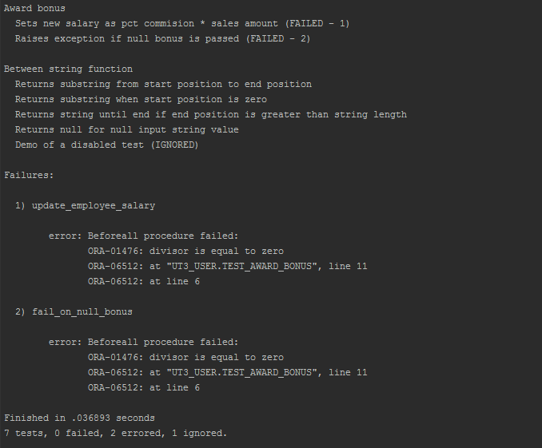

utPLSQL provides the following reporting formats.

# Documentation reporter

The `ut_documentation_reporter` is the default reporting format used by the framework.
It provides a human readable test results.

To invoke tests with documentation reporter use one of following calls from sql console (SQLPlus)  

`exec ut.run();`

`exec ut.run(ut_documentation_reporter());`

Example outputs from documentation reporter.

The documentation report provides the following information.
- Test suite name or test package name  (nested with suitepath if suitepath is used)
- Test description name or test procedure name
- Information about test failing `(FAILED - n)` 
- Information about disabled test `(IGNORED)` 
- List of all errors and failures
- Summary with total number of tests, number of tests with status and timing for the execution 

## Color output from documentation reporter

When invoking tests with documentation reporter and your command line supports ANSICONSOLE (default on Unix) [available for Windows](http://adoxa.altervista.org/ansicon/), you can obtain the coloured outputs from the documentation reporter.

To invoke tests with documentation reporter in color mode use one of following calls.  

`exec ut.run(a_color_console=>true);`

`exec ut.run(ut_documentation_reporter(), a_color_console=>true);`

Example outputs from documentation reporter.

# JUnit reporter 

Most of continuous integration servers (like Jenkins) are capable of consuming unit test execution results in [JUnit](https://en.wikipedia.org/wiki/JUnit) format.
The `ut_junit_reporter` in earlier version referred as `ut_xunit_reporter` is producing outcomes as JUnit-compatible XML unit test report, that can be used by CI servers to display their custom reports and provide metrics (like tests execution trends).
Please note that in previous versions it was called ut_xunit_reporter and for backward compatibility that name still exists.

Invocation of tests with JUnit reporter.  

`exec ut.run(ut_junit_reporter());`

The `ut_junit_reporter` doesn't accept any arguments.

Example of junit report integrated with [Jenkins CI](https://jenkins.io/)

Example of failure report details
 

# Teamcity reporter

[Teamcity](https://www.jetbrains.com/teamcity/) is a CI server by Jetbrains. It supports JUnit reporting and additionally has it's own format of reporting that allows tracking of progress of a CI step/task as it executes.
The TeamCity format developed by Jetbrains is supported by utPLSQL with `ut_teamcity_reporter`.

Invocation of tests with Teamcity reporter.  

`exec ut.run(ut_teamcity_reporter());`

The `ut_teamcity_reporter` doesn't accept any arguments.

Example of unit test report from Teamcity CI server.

Example of failure report details
 

# Sonar test reporter
If you are using [SonarQube](https://www.sonarqube.org/) or [SonarCloud](https://about.sonarcloud.io/) to do static code analysis for you PLSQL projects, your code analysis can benefit from code coverage and test results.
utPLSQL provides two reporters to for SonarQube:
- `ut_sonar_test_reporter` - provides an XML output of each test executed per each project test file (package) 
- `ut_coverage_sonar_reporter` - provides XML output of code coverage per each project source file 

`ut_sonar_test_reporter` needs to be called with a list of paths to test files (packages).
The paths to files can be relative to the project root directory (recommended) or be absolute. 

`ut_coverage_sonar_reporter` needs to be called with a list of paths to source files for your project.
The paths to files can be relative to the project root directory (recommended) or be absolute.

Providing invalid paths or paths to non-existing files will result in failure when publishing test results/coverage results to sonar server.

For details on how to invoke reporter with paths, see the **Coverage reporters** section.

# TFS / VSTS Reporter
If you are using [TFS](https://www.visualstudio.com/tfs/) or [VSTS](https://www.visualstudio.com/team-services/) to do static code analysis for you PLSQL projects and run builds, your code analysis can benefit from code coverage and test results. TFS reporter is designed specifically to [work with Microsoft Team Fundation Server](https://docs.microsoft.com/en-us/vsts/build-release/tasks/test/publish-test-results?view=vsts) report format which is very old version of [JUnit](https://github.com/windyroad/JUnit-Schema/blob/master/JUnit.xsd).
Main diffrence between standard JUnit is that <testsuite> elements cannot be nested and attribute skipped is not present.

utPLSQL provides test reporter to for TFS / VSTS server:
- `ut_tfs_junit_reporter` - provides an XML output of each test executed per each project test file (package) 

Example of test report from TFS CI server.

Summary:

Details:

# Coverage reporters

utPLSQL comes with a set of build-in coverage reporters. Have a look into the [coverage documentation](coverage.md) to learn more about them.

# Debug reporter

The `ut_debug_reporter` provides a highly verbose output containing thorough details about framework and test execution.

Use this reporter only when you need to investigate framework issues or raise a bug report to utPLSQL team.

Usage of this reporter might have impact on performance of test-suite execution.

Amongst others, reporter provides the following information:
- framework version
- database version
- database OS
- database, instance and session NLS settings
- timing of each event
- time between events logged
- time from start of the run
- stack trace
- information about input parameters for the run including
    - run paths
    - source file mappings
    - test file mappings
    - coverage schemas
    - coverage exclusions and inclusions
    - client character set
- information about every step of the run including
    - every suite and context
    - every before/after procedure
    - every test
    - every expectation and it's result
    
Some of the information in debug log might be redundant.

**Note:**
>Some of the information in debug log may be sensitive. In particular:
> - expectation results and messages (logged even for successful runs)
> - test structure
> - db object names
> - etc.

# Custom reporters

It is possible to add your own reporters by creating an appropriate object type. In principle, it has to be a subtype of `ut_reporter_base`. However, if the reporter is expected to produce output consumable by a client oustside of the database (e.g. the data has to be reported to the screen or to a file), then you should base it on `ut_output_reporter_base` (which is a subtype of `ut_reporter_base`). In contrast, if you would like to create a reporter that, for example, saves the data to a database table, then it should be based directly on `ut_reporter_base`. (Currently, all reporters in the utPLSQL framework are based on `ut_output_reporter_base`.) Coverage reporters are based on `ut_coverage_reporter_base` (a subtype of `ut_output_reporter_base`).

If need to produce a colored text output from the custom reporter, then you can build it basing on `ut_console_reporter_base` (a subtype of `ut_output_reporter_base`). In many cases it may also be more convenient to create the custom reporter type under a more specialized type, like `ut_documentation_reporter` or `ut_junit_reporter`, and override just some of the functionality.

It is recommended to create the reporter type in the schema where utPLSQL is installed (by default it is the `UT3` schema). Note that before running the utPLSQL uninstall scripts, all custom reporters should be dropped (cf. [the installation documentation](install.md)). In particular, when upgrading to a newer version of utPLSQL, one has to drop the custom reporters and recreate them after the upgrade.

**Note:**
> It is possible, but cumbersome, to use another schema for storing the custom reporters. This requires to create a synonym for the base reporter type in the schema that is going to own the custom reporter, and to provide appropriate grants both to the owner of the custom reporter and to the user running the reporter. After upgrading or reinstalling utPLSQL, the extra privileges need to be recreated. This approach is not recommended.

Assuming that the custom reporter type is created in the `UT3` schema, to run the tests using a custom reporter just call: `exec ut.run(ut3.custom_reporter_name());`, optionally providing parameter values to the `custom_reporter_name` constructor.

One may get acquainted with the source code of the standard reporters bundled with utPLSQL (including the coverage reporters) by browsing the [`source/reporters/`](https://github.com/utPLSQL/utPLSQL/tree/develop/source/reporters) directory. The base reporter types `ut_reporter_base`, `ut_output_reporter_base` and `ut_console_reporter_base` are defined in [`source/core/types`](https://github.com/utPLSQL/utPLSQL/tree/develop/source/core/types). The base coverage reporter type `ut_coverage_reporter_base` is in [`source/core/coverage`](https://github.com/utPLSQL/utPLSQL/tree/develop/source/core/coverage). There are also two examples of custom reporters in [`examples/custom_reporters/`](https://github.com/utPLSQL/utPLSQL/tree/develop/examples/custom_reporters), both extending the functionality of `ut_documentation_reporter`:

* `ut_custom_reporter` accepts an integer parameter `a_tab_size`; it alters the behaviour of `ut_documentation_reporter` by changing the size of the indentation according to the parameter value (by default the indentation is increased).
* `ut_expectations_reporter` accepts a `varchar2` parameter `a_report_all_expectations`; if its value is `'Y'` (which is the default), then the reporter shows the results of all expectations that are run. This stays in contrast with `ut_documentation_reporter`, which shows the results of all tests that are run, but only of the expectations that failed (keep in mind that a single test may consist of several expectations).
